# Rexx built-in functions for Unicode: enhancements and modifications

```
┌───────────────────────────────────────────────────────────────────────────────────────────────────────────────┐  
│ This file is part of The Unicode Tools Of Rexx (TUTOR).                                                       │
│ See https://github.com/RexxLA/rexx-repository/tree/master/ARB/standards/work-in-progress/unicode/UnicodeTools │
│ Copyright © 2023, 2024 Josep Maria Blasco <josep.maria.blasco@epbcn.com>.                                     │
│ License: Apache License 2.0 (https://www.apache.org/licenses/LICENSE-2.0).                                    │
└───────────────────────────────────────────────────────────────────────────────────────────────────────────────┘
``` 

This article concentrates on documenting enhancements and modifications to _existing_ built-in functions (BIFs). If you want to know about _new_ BIFs, please refer
to the accompanying document [New built-in functions](new-functions.md).

## Introduction: What are the enhanced built-in functions and how are they implemented

### Statement of the problem

The purpose of RXU, the Rexx Preprocessor for Unicode, is to offer a Unicode-enhanced
Rexx experience that is as seamless and as simple as possible. A Unicode-enabled Rexx program ("a RXU
program" for short) is a program written in a language based on standard (oo)Rexx
and enhanced with a set of Unicode specific _additions_ and _modifications_.

As an example of _additions_, RXU programs allow for four new types of literal strings.
These are described in an accompanying document, [_New types of strings_](string-types.md).
There is also a set of [new built-in functions](new-functions.md), described in another document.

_Modifications_ become necessary when the behaviour of already existing mechanisms of Rexx
has to be altered. In our case, for instance, we will expect that RXU programs know 
how to manage Unicode strings, and thus bring the rich set of features of Rexx to the Unicode world. 
But this will mean that _existing_ BIFs will have to operate with _new_ entities (i.e., Unicode strings) 
and, of course, they will most probably have to produce _new and different_ results when processing these new entities.

We are then confronted to the task of enhancing, and in this sense _redefining_, existing BIFs.
But to redefine BIFs in Rexx is quite difficult.

### Ways to substitute BIFs. Necessity of a preprocessor

As is well known, built-in functions (BIFs) are _second_ in the Rexx search order

> Functions are searched in the following sequence: internal routines, built-in functions, external
functions (_rexxref_, 7.2.1, "Search Order").

As a consequence, when one wants to redefine a BIF, the only possible way is to write an _internal_
function with the same name:

> If the call or function invocation uses a literal string, then the search for internal label is bypassed. This
bypass mechanism allows you to extend the capabilities of an existing internal function, for example,
and call it as a built-in function or external routine under the same name as the existing internal
function. To call the target built-in or external routine from inside your internal routine, you must use a
literal string for the function name (_Ibid._).

If, as we stated above, we want to offer an experience that is "as seamless and as simple as possible", the
only way to achieve that is to implement a _preprocessor_. The alternative would be to define a kind of
"epilog" that would contain all the redefined functions, and ask the programmers to copy it at the
bottom of their programs: a maintenance nightmare, and nothing that can be called "seamless" or "simple".

### Ways to substitute BIFs, part II

A preprocessor could add such an epilog to RXU programs in an automated way. But, if we counted on
the idea of a (sufficiently powerful) preprocessor, we could also opt for a different strategy. Instead
of writing an internal routine for each BIF that we wanted to modify or enhance, we could _substitute_ the name of each BIF
in every BIF call, and call a different function instead. Now, that different function would have a new name,
an _external function name_. Clashes with existing BIF names would disappear, and, with them, the need
to define internal routines. That's a much neater solution. Indeed, if working with ooRexx, all the
external routines can be grouped in some few packages, and the task of the preprocessor will practically be reduced,
beyond the substitution of names and the implementation of new string types, to the trivial addition
of a ``::Requires`` directive or a function call that enables the new external functions.

The RXU preprocessor for Unicode follows this approach. It substitutes calls to an arbitrary rexx BIF, say ``F``, with calls to ``!F``,
i.e., an exclamation mark, "!", is prepended to the BIF name. For example the preprocessor would translate ``Length(var)``
to ``!Length(var)``.

### Subtleties of substitution

The _basic idea_ of such a substitution is very easy to explain, but, as it often happens with basic ideas, its concrete realization is nothing
but trivial. You cannot simply pick every occurence of, say, ``"LENGTH"`` and blindly substitute it with ``"!LENGTH"``:
that would unintendedly transform _method calls_, like ``n = var~length``, for example. 

Ok, you could say: let's reduce ourselves to the case where a BIF name is followed by a left parentheses. 
But this leaves out ``CALL`` statements, and there are methods that have arguments anyway...

The RXU Rexx Preprocessor for Unicode handles all these complexities, and many more, except one: if there is an internal routine
with the same name as a BIF, it substitutes names anyway. It should not, but it's beyond its power, in the current
version. This limitation will be addressed in a future release.

---

# Alphabetic list of implemented BIFs

An alphabetic list of Unicode-enabled BIFs follows. This list will be updated when new functions will be enabled for Unicode. In most cases, only the new functionality is described,

## C2X (Character to heXadecimal)


Returns a BYTES string that represents _string_ converted to hexadecimal.

There has been much debate about C2X. RXU follows a very simple approach to determine what should be returned:
_always return the C2X of the BYTES value of the argument_.

So, for example, ``Text("(Man)"U) == "👨"T`` is a TEXT string. Its UTF-8 representation, i.e., it's conversion
to BYTES, is the UTF-8 representation of the codepoint for the "Man" character, that is, "F0 9F 91 A8"X.
And this will be, unsurprisingly, the value of ``C2X("👨"T)``:

```
C2X("👨"T) = "F0 9F 91 A8"X
```

## CHARIN 

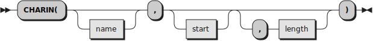

The CHARIN BIF is enhanced by supporting the _encoding_ options specified in the STREAM OPEN command.
* When an _encoding_ is not specified for a stream, the standard BIF is called.
* When an _encoding_ is specified, the action taken depends on the encoding _target_.
    * When the encoding _target_ is __TEXT__ (the default), a TEXT string, composed of grapheme clusters, is returned. The string is normalized to NFC before being returned.
    * When the encoding _target_ is __GRAPHEMES__, a GRAPHEMES string, composed of grapheme clusters, is returned. The string is returned as-is, without attempting any normalization.
    * When the encoding _target_ is __CODEPOINTS__, the appropiate number of Unicode codepoints is read and is returned in a string.
* The handling of ill-formed Unicode sequences depends on the value of the encoding _error_handling_.
    * When _error_handling_ is set to __REPLACE__ (the default), any ill-formed character will be replaced by the Unicode Replacement Character (U+FFFD).
    * When _error_handling_ is set to __SYNTAX__, a Syntax condition will be raised.
 
Character positioning is precautionarily disabled in some circumstances:
* When the _encoding_ is a variable-length encoding.
* When the _encoding_ is a fixed-length encoding, but a _target_ of __TEXT__ or __GRAPHEMES__ has been requested.

Character positioning at the start of the stream (that is, when _start_ is specified as __1__) will work unconditionally.

Please refer to the accompanying document [_Stream functions for Unicode_](stream.md) for a comprehensive vision of the stream functions for Unicode-enabled streams.

## CHAROUT

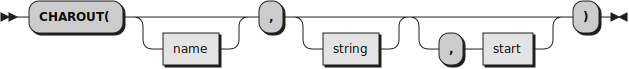

The CHAROUT BIF is enhanced by supporting the _encoding_ options specified in the STREAM OPEN command.
* When an _encoding_ has not been specified for a stream, the standard BIF is called.
* When the _string_ type is __TEXT__, __GRAPHEMES__ or __CODEPOINTS__, the _string_ presentation is well-formed UTF-8 and will be used as-is.
* When the _string_ type is __BYTES__, it will be checked for UTF-8 well-formedness.
* In both cases, the resulting string is then encoded using the _encoding_ specified in the STREAM OPEN command.
    * When __SYNTAX__ was specified as the stream _error_handling_ option, a Syntax error is raised in case an encoding error is found, or if the argument _string_ contains ill-formed UTF-8.
    * When __REPLACE__ was specified as the stream _error_handling_ option, ill-formed characters will be replaced by the Unicode Replacement Character (``U+FFFD``).
      
Character positioning is precautionarily disabled in some circumstances:
* When the _encoding_ is a variable-length encoding.
* When the _encoding_ is a fixed-length encoding, but a _target_ of __TEXT__ or __GRAPHEMES__ has been requested.
  
Character positioning at the start of the stream (that is, when _start_ is specified as __1__) will work unconditionally.

Please refer to the accompanying document [_Stream functions for Unicode_](stream.md) for a comprehensive vision of the stream functions for Unicode-enabled streams.

## CHARS 

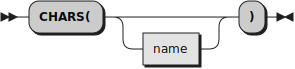

The CHARS BIF is modified to support the _encoding_ options specified in the STREAM OPEN command.

* When an _encoding_ has not been specified for stream _name_, the standard BIF is called.
* When an _encoding_ has been specified for stream _name_, the behaviour of CHARS depends on the stream _encoding_ options.
    * When the _encoding_ is variable-length or the _target_ type is __TEXT__ or __GRAPHEMES__, the CHARS function returns __1__ to indicate that data is present in the stream, or __0__ if no data is present.
    * When the _encoding_ is fixed length and the _target_ type is __CODEPOINTS__, the standard BIF is called to obtain the number of remaining bytes.
      If this number is an exact multiple of the _encoding_ length, the result of dividing the number of bytes left by the number of bytes per character of the _encoding_ is returned.
    * In all other cases, 1 is returned.

Please refer to the accompanying document [_Stream functions for Unicode_](stream.md) for a comprehensive vision of the stream functions for Unicode-enabled streams.

## CENTER (or CENTRE)

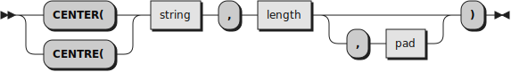

Works as the standard BIF does, but it operates on bytes, codepoints or extended grapheme clusters depending of whether _string_ is a BYTES string,
a CODEPOINTS string, or a GRAPHEMES or a TEXT string, respectively. Before ensuring that the _pad_ character is one character in length,
_pad_ is first converted, if necessary, to the type of _string_. If this conversion fails, a Syntax error is raised.

__Examples.__

```
....+....1....+....2....+....3....+....4....+....5
Center("Man"Y,5)                                  -- " Man "
Center("Man"Y,5,"+")                              -- "+Man+"
Center("Man"Y,5,"👨")                             -- Syntax error ('CENTER argument 3 must be a single character; found "👨"')
Center("Man"P,5,"👨")                             -- "👨Man👨"
Center("Man"P,5,"(Man)(Zwj)(Man)"U)               -- Syntax error ('CENTER argument 3 must be a single character; found "👨‍👨"')
Center("Man"T,5,"(Man)(Zwj)(Man)"U)               -- "👨‍👨Man👨‍👨"
Center("Man"T,5,"FF"X)                            -- Syntax error ("Invalid UTF-8 sequence in position 1 of string: 'FF'X")
```

## COPIES


Works as the standard BIF does, but it operates on bytes, codepoints or extended grapheme clusters depending of whether _string_ is a BYTES string,
a CODEPOINTS string, or a GRAPHEMES or TEXT string, respectively.

## DATATYPE

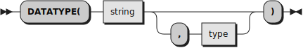

A new _type_ is admitted, __C__, for __uniCode__. 
``Datatype(string, "C")`` returns __1__ if and only if _string_
follows the Unicode string format, namely, if it consists of a blank-separated series of:
 
* Valid hexadecimal Unicode codepoints, like __61__, or __200D__, or __1F514__.
* Valid hexadecimal Unicode codepoints prefixed with __U+__ or __u+__, like __u+61__, or __U+200D__, or __u+1F514__.
* Names, alias or labels that designate a Unicode codepoint, enclosed between parentheses, like __(Latin small letter A)__,
  __(ZWJ)__, __(Bell)__, or __(&lt;Control-001d&gt;)__. Items enclosed between parentheses do not need to be separated by blanks.
 
__Examples.__

```
DATATYPE('string','C')                            -- 0
DATATYPE('61','C')                                -- 1
DATATYPE('U61','C')                               -- 0 (it's U+ or U+, not U)
DATATYPE('U+61','C')                              -- 1
DATATYPE('10661','C')                             -- 1
DATATYPE('110000','C')                            -- 0 (max Unicode scalar is 10FFFF)
DATATYPE('(Man)','C')                             -- 1
DATATYPE('(Man','C')                              -- 0 (missing parentheses)
DATATYPE('(Man)(Zwj)(Woman)','C')                 -- 1
```

## LEFT

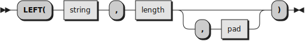

Works as the standard BIF does, but it operates on bytes, codepoints or extended grapheme clusters depending of whether _string_ is a BYTES string,
a CODEPOINTS string, or a GRAPHEMES or a TEXT string, respectively. Before ensuring that the _pad_ character is one character in length,
_pad_ is first converted, if necessary, to the type of _string_. If this conversion fails, a Syntax error is raised.

## LENGTH


When _string_ is a BYTES string, it returns the number of bytes in _string_. When _string_ is a CODEPOINTS string, it returns the number of
codepoints in _string_. When _string_ is a GRAPHEMES or a TEXT string, it returns the number of extended grapheme clusters in _string_.

__Examples.__

```
Length("a")                                       -- 1
Length("á")                                       -- "á" is "C3 A1"X
Length("á"P)                                      -- "á" is 1 codepoint
Length("👨‍👩")                                      -- 11 bytes, that was "F09F91A8E2808DF09F91A9"X
Length("👨‍👩"P)                                     -- 3 codepoints (Man + Zwj + Woman)
Length("👨‍👩"T)                                     -- 1 grapheme cluster
```

## LINEIN 

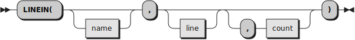

The LINEIN BIF is enhanced by supporting the _encoding_ options specified in the STREAM OPEN command.

* When an _encoding_ has not been specified for stream _name_, the standard BIF is called.
* When an _encoding_ has been specified, a line is read, taking into account the end-of-line conventions defined by the _encoding_. The line is then decoded to UTF8, and returned as a TEXT string (the default), as a GRAPHEMES string, when __GRAPHEMES__ has been specified as an _encoding_ option of the STREAM OPEN command, or as a CODEPOINTS string, when __CODEPOINTS__ has been specified as an _encoding_ option of the STREAM OPEN command.
* If an error is found in the decoding process, the behaviour of the LINEIN BIF is determined by the _error_handling_ method specified as an _encoding_ option of the STREAM OPEN command.
    * When __SYNTAX__ has been specified, a Syntax error is raised.
    * When __REPLACE__ has been specified, any character that cannot be decoded will be replaced with the Unicode Replacement character (``U+FFFD``).
 
### Line-end handling

_Preliminary note_. Rexx honors Windows line-end sequences (``"0D0A"X``) and Unix-like line-end characters (``"0A"X``), and it does so both in Windows and in Unix-like systems. 
You can try it for yourself by creating a file that contains ``"31610d0a32610d33610a34610a0d3563"X`` and reading it line-by line both on Windows and on Linux.

What happens when we are using a multi-byte encoding like UTF-16 or UTF-32? On the one hand, we will be getting false positives: ``"000A"X`` is a line end, 
but ``"0Ahh"X`` is not, irrespective of the value of ``hh``. On the other hand, we will be getting lost sequences: a ``"000D"X`` that immediately preceeds a 
``"000A"X`` should be removed by Rexx, but the current versions do not remove it.

All these details have to be taken into account by this routine.

__Implementation restriction__. Line positioning when line > 1 is not implemented when:

* The end-of-line character is not ``"0A"X``.
* The _encoding_ number of bytes per char is greater than 1.
* The _encoding_ is not fixed-length.

Some or all of these restrictions may be eliminated in a future release.

Please refer to the accompanying document [_Stream functions for Unicode_](stream.md) for a comprehensive vision of the stream functions for Unicode-enabled streams.

## LINEOUT

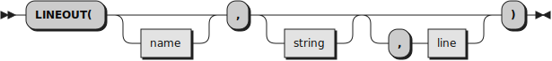

The LINEOUT BIF is enhanced by supporting the _encoding_ options specified in the STREAM OPEN command.
* When an _encoding_ has not been specified for stream _name_, the standard BIF is called.
* When an _encoding_ has been specified for stream _name_, the _string_ is decoded to that _encoding_; additionally, the _encoding_ end-of-line sequence is used.
  
__Implementation restriction__. When line > 1, line positioning is not implemented in the following cases:
* When the _encoding_ is a variable-length encoding.
* When the length of the _encoding_ end-of-line character is greater than 1.
* When the end-of-line character is not ``"0A"``.

Some or all of these restrictions may be eliminated in a future release.  

Please refer to the accompanying document [_Stream functions for Unicode_](stream.md) for a comprehensive vision of the stream functions for Unicode-enabled streams.

## LINES

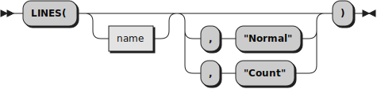

The LINES BIF is modified to support the _encoding_ options specified in the STREAM OPEN command.

__Implementation restriction__. ``LINES(name,"Count")`` will fail with a Syntax error when:
* The _encoding_ is not fixed-length.
* The length of the _encoding_ is greater than 1.
* The _encoding_ end-of-line character is different from "0A"X.
  
Some or all of these restrictions may be eliminated in a future release.  

Please refer to the accompanying document [_Stream functions for Unicode_](stream.md) for a comprehensive vision of the stream functions for Unicode-enabled streams.

## LOWER

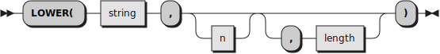

Works as the standard BIF does, but it operates on bytes, codepoints or extended grapheme clusters depending of whether _string_ is a BYTES string,
a CODEPOINTS string, or a GRAPHEMES or a TEXT string, respectively. When operating on CODEPOINTS, GRAPHEMES or TEXT strings, it implements the ``toLowercase(X)`` definition,
as defined in rule __R2__ of section "Default Case Conversion" of [_The Unicode Standard, Version 15.0 – Core Specification_](https://www.unicode.org/versions/Unicode15.0.0/UnicodeStandard-15.0.pdf):

> Map each character C in X to Lowercase_Mapping(C).

Broadly speaking, ``Lowercase_Mapping(C)`` implements the ``Simple_Lowercase_Mapping`` property, as defined in the
``UnicodeData.txt`` file of the Unicode Character Database (UCD). Two exceptions to this mapping are defined
in the ``SpecialCasing.txt`` file of the UCD. One exception not one to one: ``"0130"U``, ``LATIN CAPITAL LETTER I WITH DOT ABOVE``,
which lowercases to ``"0069 0307"U``. The second exception is for ``"03A3"U``, the final greek sigma, which lowercases
to ``"03C2"U`` only in certain contexts (i.e., when it is not in a medial position).

__Examples.__

```
Lower("THIS")                                     -- "this"
Lower("MAMÁ"Y)                                    -- "mamÁ", since "MAMÁ"Y is a Classic Rexx string
Lower("MAMÁ"P)                                    -- "mamá"
Lower('ÁÉÍÓÚÝÀÈÌÒÙÄËÏÖÜÂÊÎÔÛÑÃÕÇ'T)               -- 'áéíóúýàèìòùäëïöüâêîôûñãõç'
Lower('ὈΔΥΣΣΕΎΣ'T)                                -- 'ὀδυσσεύς' (note the difference between medial and final sigmas)
Lower('Aİ')                                       -- 'ai̇' ("6169CC87"X)
Length(Lower('Aİ'))                               -- 3
```

## POS

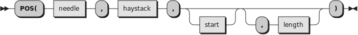

Works as the standard BIF does, but it operates on bytes, codepoints or extended grapheme clusters depending of whether _haystack_ is a BYTES string,
a CODEPOINTS string, or a GRAPHEMES or a TEXT string, respectively. If necessary, _needle_ is converted to the type of _haystack_. 
If this conversion fails, a Syntax error is raised.

__Examples:__

```
Pos('s','string')                                 -- 1
needle = '👩'                                    -- A BYTES string
haystack = '(Woman)(Zwj)(Man)'U                   -- Another BYTES string
Pos(needle,haystack)                              -- 8
needle   = CODEPOINTS(needle)                     -- 1 codepoint
haystack = CODEPOINTS(haystack)                   -- 3 codepoints
Pos(needle,haystack)                              -- 3
needle   = TEXT(needle)                           -- 1 grapheme cluster
haystack = TEXT(haystack)                         -- 1 grapheme cluster
Pos(needle,haystack)                              -- 0 (not found)
Pos('FF'X,haystack)                               -- Syntax error ("FF"X is ill-formed)
```

## REVERSE


Works as the standard BIF does, but it operates on bytes, codepoints or extended grapheme clusters depending of whether _string_ is a BYTES string,
a CODEPOINTS string, or a GRAPHEMES or a TEXT string, respectively.

__Examples:__

```
string = '(Woman)(Zwj)(Man)'U
Say string                                        -- ‍‍👩‍👨
Say string~c2x                                    -- F09F91A9E2808DF09F91A8
Say REVERSE(string)~c2x                           -- A8919FF08D80E2A9919FF0
string = CODEPOINTS(string)
Say REVERSE(string)                               -- 👨‍👩, i.e., '(Man)(Zwj)(Woan)'U
string = TEXT(string)
Say string == REVERSE(string)                     -- 1, since LENGTH(string) == 1
```

## RIGHT 

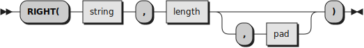

Works as the standard BIF does, but it operates on bytes, codepoints or extended grapheme clusters depending of whether _string_ is a BYTES string,
a CODEPOINTS string, or a GRAPHEMES or a TEXT string, respectively. Before ensuring that the _pad_ character is one character in length,
_pad_ is first converted, if necessary, to the type of _string_. If this conversion fails, a Syntax error is raised.

## STREAM

The STREAM BIF is enhanced by adding _encoding_ options to the OPEN and QUERY commands. 
In this version, ENCODING should be the last option specified, and it can not be used with BINARY streams.

### New options for the OPEN command

A new ENCODING fragment is added to the STREAM OPEN COMMAND:

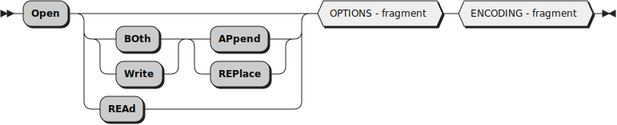

The format of the ENCODING fragment is the following:

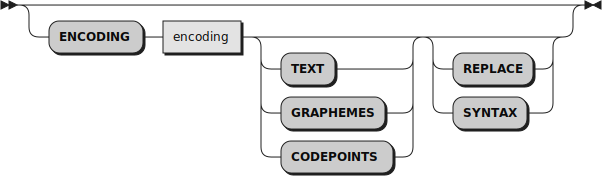

The encoding options are as follows:

* __ENCODING__ _encoding_ specifies that the file is encoded (for reading) or is to be encoded (for writing) using the _encoding_ encoding.
* __ENCODING__ _encoding_ can be followed by any of __SYNTAX__, __REPLACE__, __TEXT__, __GRAPHEMES__ or __CODEPOINTS__, in any order.
* Only one of __TEXT__, __GRAPHEMES__ or __CODEPOINTS__ can be specified; __TEXT__ is the default. This option determines the type of the strings (STRINGTYPE) that will be returned by the CHARIN and LINEIN BIFs.
* Only one of __SYNTAX__ or __REPLACE__ can be specified; __REPLACE__ is the default. When __REPLACE__ is specified, ill-formed byte sequences
  are replaced by the Unicode Replacement Character (``U+FFFD``); when __SYNTAX__ is specified, any ill-formed byte sequence raises a Syntax condition.

### New QUERY ENCODING commands

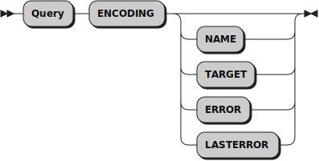

* __QUERY ENCODING__ returns a string consisting of three words, or a null string if no _encoding_ was specified.
  If the returned string is not empty, it will contain the official _encoding_ name, the _encoding_ target (that is, __TEXT__, __GRAPHEMES__ or __CODEPOINTS__), and the encoding _error_handling_ (that is, __SYNTAX__ or __REPLACE__).
* __QUERY ENCODING NAME__ returns the stream _encoding_ official name, or a null string if no _encoding_ was specified.
* __QUERY ENCODING TARGET__ returns __TEXT__, __GRAPHEMES__ or __CODEPOINTS__, or a null string if no _encoding_ was specified.
* __QUERY ENCODING ERROR__ returns __SYNTAX__ or __REPLACE__, or a null string if no _encoding_ was specified.
* __QUERY ENCODING LASTERROR__ returns the value of the characters that could not be encoded or decoded by the last stream operation. __QUERY ENCODING LASTERROR__ will return a null string if no encoding or decoding 
  errors have been produced in the stream _name_, or when the last operation was successful; if there was an error in the last stream operation, the offending line will be returned.

### Modifications and restrictions to the SEEK and POSITION STREAM commands

__Implementation restrictions__. SEEK and POSITION will raise a Syntax error in the following cases:

For character positioning,
* When the _encoding_ is variable-length.
* When __TEXT__ has been selected as the encoding _target_ type.

Positioning the stream at the start of the stream with an offset of "=1" will unconditionally succeed.

For line positioning, all the restrictions listed for character positioning apply, and, additionally:
* When the _encoding_ specifies a line-end different from ``"0A"X``.

Some or all of these restrictions may be eliminated in a future release.  

__Note.__ The source code for the enhanced stream operations can be found in the file Stream.cls.

Please refer to the stream.rxu program in the samples subdirectory for examples.

Please refer to the accompanying document [_Stream functions for Unicode_](stream.md) for a comprehensive vision of the stream functions for Unicode-enabled streams.

## SUBSTR

```
   ╭─────────╮  ┌────────┐  ╭───╮  ┌───┐  ╭───╮                                    ╭───╮
▸▸─┤ SUBSTR( ├──┤ string ├──┤ , ├──┤ n ├──┤ , ├─┬────────────┬──┬────────────────┬─┤ ) ├─▸◂
   ╰─────────╯  └────────┘  ╰───╯  └───┘  ╰───╯ │ ┌────────┐ │  │ ╭───╮  ┌─────┐ │ ╰───╯
                                                └─┤ length ├─┘  └─┤ , ├──┤ pad ├─┘
                                                  └────────┘      ╰───╯  └─────┘
```

Works as the standard BIF does, but it operates on bytes, codepoints or extended grapheme clusters depending of whether _string_ is a BYTES string,
a CODEPOINTS string, or a GRAPHEMES or a TEXT string, respectively. Before ensuring that the _pad_ character is one character in length,
_pad_ is first converted, if necessary, to the type of _string_. If this conversion fails, a Syntax error is raised.

## UPPER

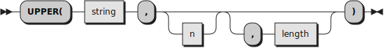

Works as the standard BIF does, but it operates on bytes, codepoints or extended grapheme clusters depending of whether _string_ is a BYTES string,
a CODEPOINTS string, or a GRAPHEMES or a TEXT string, respectively. When operating on CODEPOINTS, GRAPHEMES or TEXT strings, it implements the ``toUppercase(X)`` definition,
as defined in rule __R1__ of section "Default Case Conversion" of [_The Unicode Standard, Version 15.0 – Core Specification_](https://www.unicode.org/versions/Unicode15.0.0/UnicodeStandard-15.0.pdf):

> Map each character C in X to Uppercase_Mapping(C).

Broadly speaking, ``Uppercase_Mapping(C)`` implements the ``Simple_Uppercase_Mapping`` property, as defined in the
``UnicodeData.txt`` file of the Unicode Character Database (UCD), but a number of exceptions, defined in the ``SpecialCasing.txt`` 
file of the UCD have to be applied. Additionally, the Iota-subscript, ``"0345"X``, receives a special treatment.

__Examples.__

```
Upper("this")                                     -- "THIS"
Upper("mamá"Y)                                    -- "MAMá", since "mamá"Y is a Classic Rexx string
Upper("mamá"P)                                    -- "MAMÁ"
Upper('áéíóúýàèìòùäëïöïÿâêîôûñãõç')               -- 'ÁÉÍÓÚÝÀÈÌÒÙÄËÏÖÏŸÂÊÎÔÛÑÃÕÇ'
Upper('ᾴ')                                        -- 'ΆΙ' ("03B1 0345 0301"U --> "0391 0301 0399"U)
Upper('Straße')                                   -- 'STRASSE' (See the uppercasing of the german es-zed)
```
