# New classes

```
┌───────────────────────────────────────────────────────────────────────────────────────────────────────────────┐  
│ This file is part of The Unicode Tools Of Rexx (TUTOR).                                                       │
│ See https://github.com/RexxLA/rexx-repository/tree/master/ARB/standards/work-in-progress/unicode/UnicodeTools │
│ Copyright © 2023, 2024 Josep Maria Blasco <josep.maria.blasco@epbcn.com>.                                     │
│ License: Apache License 2.0 (https://www.apache.org/licenses/LICENSE-2.0).                                    │
└───────────────────────────────────────────────────────────────────────────────────────────────────────────────┘
``` 

## Introduction

The Rexx Preprocessor for Unicode (RXU) implements a set of Rexx extensions that allow programmers to write Unicode-enabled Rexx programs.

RXU is a work-in-progress. Its goal is to produce a proof-of-concept implementation of Unicode-enabled Rexx, limited to what has been informally called "stage 1" Unicode in some circles, namely:

* The RXU project is _Classic Rexx-first_. This means that its priority is to first _produce a procedural definition of Unicode Rexx_. This will be achieved by (a) extending the base string type to support a _polymorphic_ system, in which three different string types are supported, BYTES, CODEPOINTS and TEXT (the study of these three types will be the subject matter of this document). (b) _Extending the semantics_ of the existing built-in functions (BIFs) to work with the two Unicode string types, namely CODEPOINTS and TEXT; and: (c) _Defining new BIFs_, which will prove necessary for Unicode. A implementation of Classic Rexx, like Regina or BRexx, could be extended, if desided, by following the RXU definitions, to produce a Unicode-enabled Classic Rexx interpreter.
* RXU is procedural in its _definitions_, but it is object-oriented in its _implementation_. This means that (a) RXU is implemented in ooRexx, which is object-oriented, but specially also that (b) our implementation uses _a set of ooRexx classes_, described below.
* Our purpose is to be able to _manage Unicode strings_, i.e., read and write Unicode strings, compare and sort them, test them for (in)equality, break them into smaller components, etc. This is what we call "stage 1" Unicode. Other Unicode extensions, like allowing Unicode identifiers in Rexx programs, are considered "stage 2" (or of a later stage), and are not part of the present effort.
* The _classes_ used in the _implementation_ of RXU are, by themselves, a (partial) implementation of a Unicode-extended object-oriented Rexx (ooRexx), which is a strict superset of the procedurally defined extensions. 

## A non-object oriented presentation of the classes

From a procedural point of view, a string can have one of three __types__: ``BYTES``, ``CODEPOINTS``, or ``TEXT``. You can retrieve the type of a string by using the ``STRINGTYPE(string)`` BIF. 

### Promotion and demotion BIFs

A BYTES string can be __promoted__ to CODEPOINTS by using the ``CODEPOINTS(string)`` BIF, or to TEXT by using the ``TEXT(string)`` BIF; a CODEPOINTS string can be __demoted__ to BYTES by using the ``BYTES(string)`` BIF, or __promoted__ to TEXT by using the ``TEXT(string)`` BIF; a ``TEXT`` string can be __demoted__ to CODEPOINTS by using the ``CODEPOINTS(string)`` BIF, or to BYTES by using the ``BYTES(string)`` BIF.

Demotion always succeeds. Promotion from BYTES can fail: ``CODEPOINTS`` and ``TEXT`` require that their argument _string_ contains well-formed UTF-8. You can validate a _string_ for UTF-8 well-formedness by using the ``UTF8(string)`` BIF or the more general ``DECODE(string,"UTF-8")`` BIF.

### Semantics, and a rationale for the three types/classes system

A string is always _the same_, irrespective of its type. Changing the type of a string amounts to _changing our_ __view__ _of the string_.

Namely,

* We _view_ a BYTES string _as a string made of bytes_ (octets). This is equivalent to Classic Rexx strings, and to the String type of ooRexx. "A character" means the same as "a byte" ("an octet"). BIFs operate on characters = bytes = octets.
* We _view_ a CODEPOINTS string _as a string made of Unicode codepoints_. All the usual BIFs will continue working, but now "a character" means "a Unicode codepoint".
* We _view_ a TEXT string _as a string made of extended grapheme clusters_. All the usual BIFs will continue working, but now "a character" means "an extended grapheme cluster".

__Examples:__

```
string = "(Man)(Zero Width Joiner)(Woman)"U
Say string                                       -- "👨‍👩"   (U strings are always BYTES strings)
Say C2X(string)                                  -- "F09F91A8E2808DF09F91A9"
Say Length(string)                               -- 11
Say string[1]                                    -- "�"   string[1] == "F0"X, which is ill-formed UTF-8,
                                                 -- and gets substituted by the Replacement Character
string = Codepoints(string)                      -- Promote to the CODEPOINTS type
Say C2X(string)                                  -- "F09F91A8E2808DF09F91A9"   It's the same string,...
Say Length(string)                               -- 3   ...but its interpretation (its "view") has changed
Say string[1]                                    -- "👨"   The first codepoints, i.e., "(Man)"U
string = Text(string)                            -- Promote to the TEXT type
Say C2X(string)                                  -- "F09F91A8E2808DF09F91A9"   Still the same string,...
Say Length(string)                               -- 1   ...but its interpretation has changed once more
Say string[1]                                    -- "👨‍👩"   The first (and only) grapheme cluster
```

When a BIF has more than one string as an argument, there is always an argument which is the "main" string. For example, in POS(_needle_, _haystack_), _haystack_ is the main string. The remaining strings are  promoted or demoted, if needed, to match the type of the main string; in the case of promotions, this operation can raise a syntax error (when the string contains ill-formed UTF-8 sequences).

__Examples:__

```
Pos("E9"U, "José"T)                               -- 1   (Same as Pos( Bytes("E9"U), "José") )
Pos("80"X, "José"T)                               -- Syntax error
```

The _view_ of a string is implemented through a set of built-in functions (BIFs), namely, _Classic Rexx BIFs_, the set of functions we are used to (i.e., LENGTH, SUBSTR, POS, etc.) and _new BIFs_, necessary for Unicode.

With a few exceptions, most BIFs are at the same time _the same_ and _different_. They are _the same_ in the sense that they have the _same_ abstract definition, in terms of characters. They are _different_, because the definition of what a character is _changes_ between types, and, therefore, this _same_ definition will have a _different_ meaning. The example above illustrates very clearly these concepts: C2X is one of the few exceptional BIFs, since it always returns a BYTES string, which is _the same_, irrespective of the type of the source string. LENGTH, or the string\[n\] construction, on the other hand, operate _differently_, depending on the type of the string they operate on.

_Changing the view_ of a string is equivalent to _changing the set of BIFs_ that operate on the string.

## An object-oriented presentation of the classes

The three _types_ of a string, BYTES, CODEPOINTS and TEXT, are implemented by defining three ooRexx classes, with the corresponding names.

BYTES is a subclass of STRING. Instances of the BYTES class are composed of bytes (octets). The behaviour of BYTES strings is identical to the behaviour of STRING strings, with a few minor additions and exceptions.

CODEPOINTS is a subclass of BYTES. Instances of the CODEPOINTS class are composed of Unicode codepoints. Built-in methods like LENGTH, SUBSTR or POS operate on codepoints.

TEXT is a subclass of CODEPOINTS. Instances of the TEXT class are composed of extended grapheme clusters. Built-in methods like LENGTH, SUBSTR or POS operate on extended grapheme clusters.

### Implementation details

BYTES redefines most of the built-in methods (BIMs) in terms of LENGTH and "[]" exclusively. These (re)definitions have the following effect: BYTES becomes completely _character-agnostic_, i.e., it does not make any presupposition about the nature or width of a character. A subclass of BYTES, like CODEPOINTS or TEXT, only has to implement LENGTH and "[]", and it will automatically get all the other BIMs implemented in the terms defined by LENGTH and "[]".

For example, CODEPOINTS implements LENGTH as the number of codepoints in a string, and "\[_n_\]" returns the _n_-th codepoint in a string. By implementing these two methods, and only these two methods, all the BIMs redefined by BYTES work for CODEPOINTS strings, and they operate automatically on Unicode codepoints. The same is true if you substitute "CODEPOINTS" for "TEXT" and "Unicode codepoints" for "extended grapheme clusters".

## BYTES

BYTES is the base class of the string hierarchy. It is roughly equivalent to the ooRexx STRING class, with a few additions. For all BYTES strings, 1 character = 1 byte (1 octet). Most built-in methods (BIMs) behave in exactly the same way as the corresponding method of the STRING class.

### Operator methods

Arithmetic, logical and concatenation methods are reimplemented by the BYTES class to support the ``OPTIONS COERCIONS`` instruction. ``OPTIONS DEFAULTSTRING`` will convert unsuffixed strings to either BYTES, CODEPOINTS or TEXT, and, since CODEPOINTS subclasses BYTES and TEXT subclasses CODEPOINTS, all operations will be handled by these reimplemented operator methods.

#### Implementation details

As an example, here is the code for the multiplication operator method, "*":

```
::Method "*"
  Use Strict Arg string
  class = self~coerceTo(string,"a multiplication")
  Return class~new(self~"*":.String(string))
```

"CoerceTo" is a private method of the BYTES class. It compares the class of "self" and the class of "string", and returns the class that should be assigned to the result of the operation,
according to the ``OPTIONS COERCIONS`` setting (coerceTo raises a syntax error if ``OPTIONS COERCIONS NONE`` is in effect and ``self~class`` and ``string\class`` are different). 

Finally, the "*" method of the .String class is invoked, and the result is coerced to the class returned by coerceTo.

### c2u (Character to Unicode codepoints)

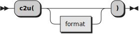

Returns a <code>BYTES</code> string such that if a <code>U</code> were appended to it
and it was inserted as a literal in a Rexx source program it would have
the same string value as the target string.

This method assumes that the target string contains well-formed UTF-8. If this is not the case, it will raise a Syntax condition. 
Please note that <code>CODEPOINTS</code> and <code>TEXT</code> strings are always well-formed.

* When _format_ is not specified, is specified as the null string, or is __"CODES"__ (the default), C2X will return a sequence of blank-separated codepoints,
  (without the ``"U+"`` prefix). Codepoints smaller than "1000"U will be padded on the left with zeros until they are four bytes long.
  Codepoints larger that "FFFF"U will have any leading zeroes removed.
* When _format_ is __"U+"__, C2X returns a list of blank-separated codepoints, with the <code>"U+"</code> prefix.
* When _format_ is __"NAMES"__, C2X returns a blank-separated list of the Unicode "Name" ("Na") property for each codepoint in the target string.
* When _format_ is __"UTF32"__, C2X returns a UTF-32 representation of the target string, 
 
__Examples:__

```
"Sí"~C2U                                -- "0053 00ED" (and "0053 00ED"U = "53 C3AD"X = "Sí")
"Sí"~C2U("U+")                          -- "U+0053 U+00ED"
"Sí"~C2U("Na")                          -- "(LATIN CAPITAL LETTER S) (LATIN SMALL LETTER I WITH ACUTE)"
"Sí"~C2U("UTF32")                       -- "00000053 000000ED"X
```

### c2x (Character to Hexadecimal)

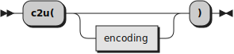

Returns a BYTES string that represents the receiving string converted to hexadecimal.

The C2X method is special, in that its result does not vary when a string changes its class (or type): since a string is _the same_, regardless of its type,
C2X also returns the same value.

__Examples:__

```
C2X("👨"T)                              -- "F09F91A8"
C2X("👨"P)                              -- "F09F91A8"
C2X("👨"B)                              -- "F09F91A8"
C2X("(Man)"U)                            -- "F09F91A8"
```

### center/centre

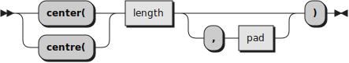

Returns a string of length _length_ with the receiving string centered in it. The _pad_ characters are added
as necessary to make up _length_. The _length_ must be a positive whole number or zero. The default
_pad_ character is blank. If the receiving string is longer than _length_, it is truncated at both ends to fit.
If an odd number of characters are truncated or added, the right-hand end loses or gains one more
character than the left-hand end.

This method works as the standard method does, but it operates on bytes, codepoints or extended grapheme clusters depending of whether the receiving string is a BYTES string, a CODEPOINTS string, or a TEXT string, respectively. Before ensuring that the _pad_ character is one character in length, _pad_ is first converted, if necessary, to the type of the receiving string. If this conversion fails, a syntax error is raised.

### copies


Returns _n_ concatenated copies of the receiving string. The _n_ must be a positive whole number or zero.

This method works as the standard method does, but it operates on bytes, codepoints or extended grapheme clusters depending of whether the receiving string is a BYTES string, a CODEPOINTS string, or a TEXT string, respectively.

### datatype

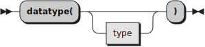

A new _type_ is admitted, __C__, for uni__C__ode. ``"String"~datatype("C")`` returns __1__ if and only if ``"String"`` follows the Unicode string format, namely, if it consists of a blank-separated series of:

* Valid hexadecimal Unicode codepoints, like 61, or 200D, or 1F514.
* Valid hexadecimal Unicode codepoints prefixed with U+ or u+, like u+61, or U+200D, or u+1F514.
* Names, alias or labels that designate a Unicode codepoint, enclosed between parentheses, like (Latin small letter A), (ZWJ), (Bell), or (<Control-001d>). Items enclosed between parentheses do not need to be separated 
  by blanks.
  
__Examples:__

```
'string'~datatype('C')                            -- 0
"61"~datatype('C')                                -- 1
'U61'~datatype('C')                               -- 0 (it's U+ or U+, not U)
'U+61'~datatype('C')                              -- 1
'10661'~datatype('C')                             -- 1
'110000'~datatype('C')                            -- 0 (max Unicode scalar is 10FFFF)
'(Man)'~datatype('C')                             -- 1
'(Man'~datatype('C')                              -- 0 (missing parentheses)
'(Man)(Zwj)(Woman)'~datatype('C')                 -- 1
```

### left

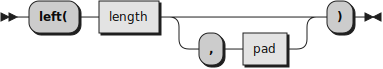

Works as the standard method does, but it operates on bytes, codepoints or extended grapheme clusters depending of whether the receiving string is a BYTES string, a CODEPOINTS string, or a TEXT string, respectively. Before ensuring that the _pad_ character is one character in length, _pad_ is first converted, if necessary, to the type of the receiving string. If this conversion fails, a syntax error is raised.

### length


When the receiving string is a BYTES string, it returns the number of bytes in the string. When the receiving string is a CODEPOINTS string, it returns the number of codepoints in the string. When the receiving string is a TEXT string, it returns the number of extended grapheme clusters in the string.

__Examples:__

```
"a"Y~length                                       -- 1
"á"Y~length                                       -- 2 ("á" is "C3 A1"X)
"á"P~length                                       -- 1 ("á" is 1 codepoint)
"👨‍👩"Y~length                                      -- 11 bytes, that was "F09F91A8E2808DF09F91A9"X
"👨‍👩"P~length                                      -- 3 codepoints (Man + Zwj + Woman)
"👨‍👩"T~length                                      -- 1 grapheme cluster
```

### lower

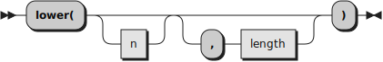

Works as the standard method does, but it operates on bytes, codepoints or extended grapheme clusters depending of whether the receiving string is a BYTES string, a CODEPOINTS string, or a TEXT string, respectively. When operating on CODEPOINTS or TEXT strings, it implements the ``toLowercase(X)`` definition, as defined in rule R2 of section "Default Case Conversion" of
_(The Unicode Standard, Version 15.0 – Core Specification)[https://www.unicode.org/versions/Unicode15.0.0/UnicodeStandard-15.0.pdf]_:

> Map each character C in X to Lowercase_Mapping(C).

Broadly speaking, ``Lowercase_Mapping(C)`` implements the ``Simple_Lowercase_Mapping`` property, as defined in the ``UnicodeData.txt`` file of the Unicode Character Database (UCD). 
Two exceptions to this mapping are defined in the ``SpecialCasing.txt`` file of the UCD. One exception is not one to one: ``"0130"U``, ``LATIN CAPITAL LETTER I WITH DOT ABOVE``, which lowercases to ``"0069 0307"U``. The second exception is for ``"03A3"U``, the final greek sigma, which lowercases to ``"03C2"U`` only in certain contexts (i.e., when it is not in a medial position).

__Examples:__

```
"THIS"~lower                                      -- "this"
"MAMÁ"Y~lower                                     -- "mamÁ", since "MAMÁ"Y is a Classic Rexx string
"MAMÁ"P~lower                                     -- "mamá"
'ÁÉÍÓÚÝÀÈÌÒÙÄËÏÖÜÂÊÎÔÛÑÃÕÇ'T~lower                -- 'áéíóúýàèìòùäëïöüâêîôûñãõç'
'ὈΔΥΣΣΕΎΣ'T~lower                                 -- 'ὀδυσσεύς' (note the difference between medial and final sigmas)
'Aİ'P~lower                                       -- 'ai̇' ("6169CC87"X)
'Aİ'P~lower~length                                -- 3
```

### pos

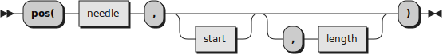

Works as the standard method does, but it operates on bytes, codepoints or extended grapheme clusters depending of whether the receiving string is a BYTES string, a CODEPOINTS string, or a TEXT string, respectively. If necessary, _needle_ is converted to the type of the receiving string. If this conversion fails, a syntax error is raised.

__Examples:__

```
'string'~pos('s')                                 -- 1
needle = '👩'                                    -- A BYTES string
haystack = '(Woman)(Zwj)(Man)'U                   -- Another BYTES string
haystack~pos(needle)                              -- 8
needle   = Codepoints(needle)                     -- 1 codepoint
haystack = Codepoints(haystack)                   -- 3 codepoints
haystack~pos(needle)                              -- 3
needle   = Text(needle)                           -- 1 grapheme cluster
haystack = Text(haystack)                         -- 1 grapheme cluster
haystack~pos(needle)                              -- 0 (not found)
haystack~pos('FF'X)                               -- Syntax error ("FF"X is ill-formed UTF-8)
```

### reverse


Works as the standard method does, but it operates on bytes, codepoints or extended grapheme clusters depending of whether the receiving string is a BYTES string, a CODEPOINTS string, or a TEXT string, respectively.

__Examples:__

```
string = '(Woman)(Zwj)(Man)'U
Say string                                        -- ‍‍👩‍👨
Say string~c2x                                    -- F09F91A9E2808DF09F91A8
Say string~reverse~c2x                            -- A8919FF08D80E2A9919FF0
string = Codepoints(string)
Say string~reverse                                -- 👨‍👩, i.e., '(Man)(Zwj)(Woan)'U
string = Text(string)
Say string == string~reverse                      -- 1, since LENGTH(string) == 1
```

### right

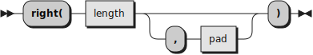

Works as the standard method does, but it operates on bytes, codepoints or extended grapheme clusters depending of whether the receiving string is a BYTES string, a CODEPOINTS string, or a TEXT string, respectively. Before ensuring that the _pad_ character is one character in length, _pad_ is first converted, if necessary, to the type of the receiving string. If this conversion fails, a syntax error is raised.

### stringtype

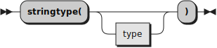

If you specify no argument, this method returns __BYTES__ when receiving string is a BYTES string,
__CODEPOINTS__ when receiving string is a CODEPOINTS string,
__GRAPHEMES__ when receiving string is a GRAPHEMES string,
and __TEXT__ when receiving string is a TEXT string.

If you specify _type_, it has to be one of __BYTES__, __CODEPOINTS__, __GRAPHEMES__ or __TEXT__ (case insensitive). In that case, the method returns
__.true__ when the receiving string class matches _type_, and __.false__ otherwise.

### substr

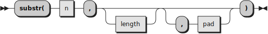

Works as the standard method does, but it operates on bytes, codepoints or extended grapheme clusters depending of whether the receiving string is a BYTES string, a CODEPOINTS string, or a TEXT string, respectively. Before ensuring that the _pad_ character is one character in length, _pad_ is first converted, if necessary, to the type of the receiving string. If this conversion fails, a syntax error is raised.

### upper

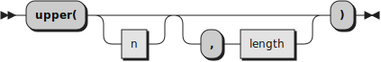

Works as the standard method does, but it operates on bytes, codepoints or extended grapheme clusters depending of whether the receiving string is a BYTES string, a CODEPOINTS string, or a TEXT string, respectively. When operating on CODEPOINTS or TEXT strings, it implements the ``toUppercase(X)`` definition, as defined in rule R1 of section "Default Case Conversion" of _(The Unicode Standard, Version 15.0 – Core Specification)[https://www.unicode.org/versions/Unicode15.0.0/UnicodeStandard-15.0.pdf]_:

> Map each character C in X to Uppercase_Mapping(C).

Broadly speaking, ``Uppercase_Mapping(C)`` implements the ``Simple_Uppercase_Mapping`` property, as defined in the ``UnicodeData.txt`` file of the Unicode Character Database (UCD), but a number of exceptions, defined in the ``SpecialCasing.txt`` file of the UCD have to be applied. Additionally, the Iota-subscript, ``"0345"X``, receives a special treatment.

__Examples:__

```
"this"~upper                                      -- "THIS"
"mamá"Y~upper                                     -- "MAMá", since "mamá"Y is a Classic Rexx string
"mamá"P~upper                                     -- "MAMÁ"
'áéíóúýàèìòùäëïöïÿâêîôûñãõç'~upper                -- 'ÁÉÍÓÚÝÀÈÌÒÙÄËÏÖÏŸÂÊÎÔÛÑÃÕÇ'
'ᾴ'4 upper                                        -- 'ΆΙ' ("03B1 0345 0301"U --> "0391 0301 0399"U)
'Straße'~upper                                    -- 'STRASSE' (See the uppercasing of the german es-zed)
```

### u2c (Unicode codepoints to Character)


This method inspects the target string for validity (see below). If valid,
it translates the corresponding codepoints to UTF8, and then returns the translated string.
If not valid, a Syntax condition is raised.

You can use the ``DATATYPE(string, "C")`` BIF  or the ``DATATYPE("C")`` method to verify whether a string is a proper Unicode codepoints string.

The target string is valid when it contains a blank-separated sequence of either:

* Hexadecimal Unicode codepoints, like ``41``, ``E9`` or ``1F514``.
* Hexadecimal Unicode codepoints preceded with ``U+`` or ``u+``, like ``U+41``, ``u+E9`` or ``U+1F514``.
* Unicode character names, enclosed between parentheses, like ``(Bell)``, ``(Zero Width Joiner)`` or
  ``(Latin small letter a with acute)``.
* Unicode character alias, enclosed between parentheses, like ``(End of line)`` or ``(Del)``.
* Unicode character labels, enclosed between parentheses, like ``(<Control-0010>)``. Please note that Unicode labels are enclosed themselves between "&lt;" and
  "&gt;" signs.

When searching for names, aliases and labels, spaces, medial hypens and underscores are ignored (with the exception of ``hangul jungseong o-e``), as are case
differences. Therefore, ``(Zero Width Joiner)`` is identical to ``(ZERO WIDTH JOINER)``, to ``(ZeroWidthJoiner)``, to ``(Zero_Width_Joiner)`` and
to ``(Zero-Width Joiner)``: they are all a reference to "200D"U.

A separating space is not necessary after a closing parentheses, or before an opening parentheses.

__Examples:__

```
"41"~U2C                                -- "A"
"U+41"~U2C                              -- "A"
"u+0041"~U2C                            -- "A"
"(Latin Capital Letter A)"~U2C          -- "A"
"41 42"~U2C                             -- "AB"
"1F514"~U2C                             -- "🔔" 
"(Bell)"~U2C                            -- "🔔"
"A(Bell)"~U2C                           -- "A🔔"
```

## CODEPOINTS

A CODEPOINTS string is composed of Unicode codepoints. The CODEPOINTS class is a subclass of the BYTES class. The CODEPOINTS class redefines the most basic BIMs (\[\] and LENGTH), and the other BIMs, being defined on 
those, work automatically.

Instances of the class can be created by resorting to the class ``init`` method (``.Codepoints~new("string")``), 
by using the new built-in function ``CODEPOINTS(string)`` (``var = CodePoints("string")``), or by using the
new ``"string"P`` string notation (requires the use of the RXU
Rexx Preprocessor for Unicode). The strings are checked for UTF-8 well-formedness,
and a syntax error is raised if they are found to be ill-formed.

Instances of the CODEPOINTS class _present_ themselves as UTF-8 strings, that is, they
look as UTF-8 strings, can be compared to raw UTF-8 strings, and so on. We write
_present_ instead of _represent_ because we are not compromising on
an (internal) _representation_ of the codepoints, but on a frontier
interchange _presentation_: when convenient, the strings look as a "normal"
UTF-8 string, and that's all you need to know.

### Implementation details, and some philosophical comments about the concept of "internal representation"

Indeed, the current implementation of the CODEPOINTS class uses _two_ forms of the same string as its internal state, UTF-8 and UTF-32.
When you ask for the LENGTH of a CODEPOINTS string, the length of the UTF-32 string is being returned, after dividing it by 4. In other cases,
the UTF-8 string is used. There is no single entity that can be called "the" internal representation of a CODEPOINTS string, but a set
of instance variables that, together, constitute the internal state. This is not a novelty brought by RXU, but the way things are
in the object-oriented world. 

Similar things can be said, _mutatis mutandis_, of the TEXT class.

There is no _internal representation_ of a Unicode string (or, if you prefer, there might be one, but it would be equivalent to
its internal state, which is complexly structured, can hold many different values, and does not correspond to any basic
data type or simple memory fragment). There is, however, a clearly defined UTF-8 _presentation_ of a string. The fact
that the presentation of a string is always UTF-8 allows simple comparisons between strings of different types, and, in general,
allows to define clear rules for the interoperability of strings of different types.

C2X returns the hexadecimal value of the _presentation_ of a string. Since a string is always _the same_, regardless of its type,
C2X is, therefore, type-invariant.

## TEXT

A TEXT string os composed of Unicode extended grapheme clusters. The TEXT class is a subclass of the CODEPOINTS class. The TEXT class redefines the most basic BIMs (\[\] and LENGTH), and the other BIMs, being defined on
those, work automatically.

Instances of the class can be created by resorting to the class ``init`` method (``.Text~new("string")``), 
by using the new built-in function ``TEXT(string)`` (``var = TEXT("string")``), or by using the
new ``"string"T`` string notation (requires the use of the RXU
Rexx Preprocessor for Unicode). The strings are checked for UTF-8 well-formedness,
and a syntax error is raised if they are found to be ill-formed.
