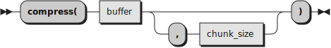
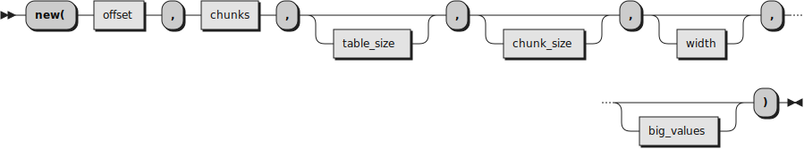

## The MultiStageTable class

```
┌───────────────────────────────────────────────────────────────────────────────────────────────────────────────┐  
│ This file is part of The Unicode Tools Of Rexx (TUTOR).                                                       │
│ See https://github.com/RexxLA/rexx-repository/tree/master/ARB/standards/work-in-progress/unicode/UnicodeTools │
│ Copyright © 2023, 2024 Josep Maria Blasco <josep.maria.blasco@epbcn.com>.                                     │
│ License: Apache License 2.0 (https://www.apache.org/licenses/LICENSE-2.0).                                    │
└───────────────────────────────────────────────────────────────────────────────────────────────────────────────┘
```

This class, defined in the ``/components/utilities/MultiStageTable.cls`` package, specializes in producing two-stage tables, three-stage tables, or, in general multi-stage tables.

Multi-stage tables are recommended in [_The Unicode Standard 15.0_](https://www.unicode.org/versions/Unicode15.0.0/UnicodeStandard-15.0.pdf), section 5.1, 
_Data Structures for Character Conversion_, "Multistage Tables", pp. 196–7.

This is not a general implementation of multi-stage tables, but a custom, tailored one, specific to Unicode.

The indexes for these tables run from 0 to the size of the buffer. Negative values will raise a syntax error, and indexes greater than the size of the buffer will return 
_width_ copies of "00"X.

### compress (Class method)



The _compress_ method compresses a _buffer_ and returns two smaller, compressed, tables, "chunks" and "offsets" (see below). The _chunk_size_ argument, if specified, should be a power of two and a divisor of the length of
the buffer; _chunk_size_ defaults to 256.

_Buffer_ is a _n_-byte string, where _n_ is a multiple of _chunk_size_.

The compression technique works as follows: the _buffer_ source string is supposed to be compressible, i.e., it is supposed to contain different segments which are identical
(for example, because they are copies of ``"00"X``). The _buffer_ string will be broken in a series of substrings of size _chunk_size_, and, 
instead of storing the substring itself, we will store a reference to the substring. Thus, when two identical substrings of _buffer_ are found, 
the first copy is stored, only once, in an indexed "chunks" table, and its offset (divided by _chunk_size_) is stored
in a separate "offsets" table. A reference is supposed to be much smaller than the subarray itself, and this makes for the desired compression.

__Note:__ To allow for maximum compression, we are supposing that the quantity of different sub-arrays does not exceed 256. This allows to store the references to the sub-arrays in a single byte.

### []

![Diagram for the MultiStageTable [] method](img/MultiStageTable_index.svg)

Returns the _n_-th element of the multi-stage table, when 0 < _n_ <= _table_size_, or a string containing _width_ copies of ``"00"X``, when _n_ > _table_size_. 
Negative or non-numeric values of _n_ will raise a Syntax error.

### new



Creates a new multi-stage table. This will be a two-stage table when _big_values_ is not specified or has the ``.Nil`` value (the default), 
and a three-stage table when _big_values_ is specified as a non-nil value.

The _offset_ and _chunks_ tables should have been created by the _compress_ class method; _chunk_size_, when specified, should be the same value
used in the _compress_ call, and a power of two. _Table_size_ should be the size of the _buffer_ used in the _compress_ call; it defaults to 2<sup>17</sup>.

_Width_ and _big_values_ are optional. When _width_ is specified for a two-stage table, a string of _width_ bytes will be returned by the "[]" call;
when _width_ is specified for a three-stage table, the 1-byte value obtained from _offset_ and _chunks_ is multiplied by _width_ and used as an index into _big_values_,
to return a substring of _width_ bytes.
