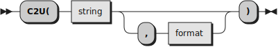
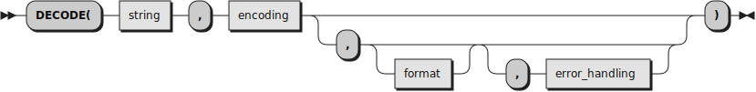
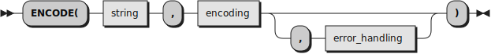
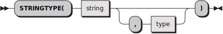
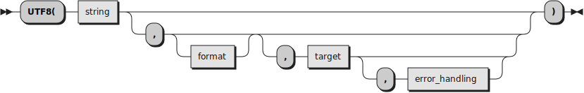

# New built-in functions

```
┌───────────────────────────────────────────────────────────────────────────────────────────────────────────────┐  
│ This file is part of The Unicode Tools Of Rexx (TUTOR).                                                       │
│ See https://github.com/RexxLA/rexx-repository/tree/master/ARB/standards/work-in-progress/unicode/UnicodeTools │
│ Copyright © 2023, 2024 Josep Maria Blasco <josep.maria.blasco@epbcn.com>.                                     │
│ License: Apache License 2.0 (https://www.apache.org/licenses/LICENSE-2.0).                                    │
└───────────────────────────────────────────────────────────────────────────────────────────────────────────────┘
``` 

The Rexx Preprocessor for Unicode implements a series of _new_ built-in functions (BIFs). Follow [this link](built-in.md) if you want to read about modifications to _existing_ BIFs.

## BYTES


Returns the _string_ converted to the BYTES format.  BYTES strings are composed of 8-bit bytes, and every character in the string can be an arbitrary 8-bit value, including binary data. 
Rexx built-in-functions operate at the byte level, and no Unicode features are available (for example, LOWER operates only on the ranges ``"A".."Z"`` and ``"a".."z"``).
This is equivalent to Classic Rexx strings, but with some enhancements. See the description of the BYTES class for details.

## CODEPOINTS


Converts _string_ to a CODEPOINTS string and returns it. CODEPOINTS strings are composed of Unicode codepoints, and every character in the string can be an arbitrary Unicode codepoint. 
The argument _string_ has to contain well-formed UTF-8, or a Syntax error will be raised. When working with CODEPOINTS strings, Rexx built-in functions operate at the codepoint level, 
and can produce much richer results than when operating on BYTES strings.

Please note that CODEPOINTS, GRAPHEMES and TEXT strings are guaranteed to contain well-formed UTF-8 sequences. To test if a string contains well-formed UTF-8, you can use the ``DECODE(string,"UTF-8")`` or ``UTF8(string)`` function calls.

## C2U (Character to Unicode)



Returns a string, in character format, that represents _string_ converted to Unicode codepoints.

By default, C2U returns a list of blank-separated hexadecimal representations of the codepoints. The _format_ argument allows to select different formats for the returned string:

* When _format_ is the null string or __CODES__ (the default), C2U returns a list of blank-separated hexadecimal codepoints.
  Codepoints larger than ``"FFFF"X`` will have their leading zeros removed, if any. Codepoints smaller than ``"10000"X`` will always have four digits (by adding zeros to the left if necessary).
* When _format_ is __U+__, a list of hexadecimal codepoints is returned. Each codepoint is prefixed with the characters ``"U+"``.
* When _format_ is __NAMES__, each codepoint is substituted by its corresponding name or label, between parentheses.
  For example, ``C2U("S") == "(LATIN CAPITAL LETTER S)"``, and ``C2U("0A"X) = "(<control-000A>)"``.
* When _format_ is __UTF-32__, a UTF-32 representation of _string_ is returned.

__Examples__ (assuming an ambient encoding of UTF-8):

```
 C2U("Sí")       = "0053 00ED"       -- And "0053 00ED"U == "53 C3AD"X == "Sí".
 C2U("Sí","U+")  = "U+0053 U+00ED"   -- Again, "U+0053 U+00ED"U == "53 C3AD"X == "Sí".
 C2U("Sí","Na")  = "(LATIN CAPITAL LETTER S) (LATIN SMALL LETTER I WITH ACUTE)"
                                     -- And "(LATIN CAPITAL LETTER S) (LATIN SMALL LETTER I WITH ACUTE)"U == "Sí"
 C2U("Sí","UTF-32") = "0000 0053 0000 00ED"X
```

## DECODE



Tests whether a _string_ is encoded according to a certain _encoding_, and optionally decodes it to a certain _format_.

DECODE works as an _encoding_ validator when _format_ is omitted, and as a decoder when _format_ is specified. It is an error to omit _format_ and to specify a value for _error_handling_ at the same time (that is, if _format_ was omitted, then _error_handling_ should be omitted too).

When DECODE is used as validator, it returns a boolean value, indicating if the string is well-formed according to the specified encoding.
For example, ``DECODE(string,"UTF-8")`` returns __1__ when string contains well-formed UTF-8, and __0__ if it contains ill-formed UTF-8.

To use DECODE as a decoder, you have to specify a _format_. This argument accepts a blank-separated set of tokens.
Each token can have one of the following values: __UTF8__, __UTF-8__, __UTF32__, or __UTF-32__ (duplicates are allowed and ignored).
When __UTF8__ or __UTF-8__ have been specified, a UTF-8 representation of the decoded _string_ is returned.
When __UTF32__ or __UTF-32__ have been specified, UTF-32 representation of the decoded _string_ is returned.
When both have been specified, a two-items array is returned. The first item of the array is the UTF-8 representation of the decoded _string_,
and the second item of the array contains the UTF-32 representation of the decoded _string_.

The optional _error_handling_ argument determines the behaviour of the function when the _format_ argument has been specified.
If it has the value __""__ (the default) or __NULL__, a null string is returned when there a decoding error is encountered.
If it has the value __REPLACE__, any ill-formed character will be replaced by the Unicode Replacement Character (``U+FFFD``).
If it has the value __SYNTAX__, a syntax condition will be raised when a decoding error is encountered.

__Examples:__

```
DECODE(string, "UTF-16")                           -- Returns 1 if string contains proper UTF-16, and 0 otherwise
var = DECODE(string, "UTF-16", "UTF-8")            -- Decodes string to the UTF-8 format. A null string is returned if string contains ill-formed UTF-16.
DECODE(string, "UTF-16",,"SYNTAX")                 -- The fourth argument is checked for validity and then ignored.
DECODE(string, "UTF-16",,"POTATO")                 -- Syntax error (Invalid option 'POTATO').
var = DECODE(string, "UTF-16", "UTF-8", "REPLACE") -- Decodes string to the UTF-8 format. Ill-formed character sequences are replaced by U+FFFD.
var = DECODE(string, "UTF-16", "UTF-8", "SYNTAX")  -- Decodes string to the UTF-8 format. Any ill-formed character sequence will raise a Syntax error.
```

## ENCODE



ENCODE first validates that _string_ contains well-formed UTF-8. Once the _string_ is validated, encoding is attempted using the specified _encoding_. ENCODE returns the encoded string,
  or a null string if validation or encoding failed. You can influence the behaviour of the function when an error is encountered by specifying the optional _error_handling_ argument.
* When _error_handling_ is not specified, is __""__ or is __NULL__ (the default), a null string is returned if an error is encountered.
* When _error_handling_ has the value __SYNTAX__, a Syntax error is raised if an error is encountered.

__Examples:__

```
ENCODE(string, "IBM1047")                          -- The encoded string, or "" if string can not be encoded to IBM1047.
ENCODE(string, "IBM1047","SYNTAX")                 -- The encoded string. If the encoding fails, a Syntax error is raised.
```

## GRAPHEMES


Converts _string_ to a GRAPHEMES string and returns it. GRAPHEMES strings are composed of extended grapheme clusters, and every character in a GRAPHEMES string can be an arbitrary extended grapheme cluster. 
The argument _string_ has to contain well-formed UTF-8, or a Syntax error is raised. When working with GRAPHEMES strings, Rexx built-in functions operate at the extended grapheme cluster level, and can produce much richer results than when operating with BYTES or CODEPOINTS strings.

Please note that CODEPOINTS, GRAPHEMES and TEXT strings are guaranteed to contain well-formed UTF-8 sequences. To test if a string contains well-formed UTF-8, you can use the ``DECODE(string,"UTF-8")`` or ``UTF8(string)`` function calls.

## N2P (Name to codePoint)


Returns the hexadecimal Unicode codepoint corresponding to _name_, or the null string if _name_ does not correspond to a Unicode codepoint.

``N2P`` accepts _names_, as defined in the second column of ``UnicodeData.txt`` (that is, the Unicode "Name" \["Na"\] property), like ``"LATIN CAPITAL LETTER F"`` or ``"BELL"``;
aliases, as defined in ``NameAliases.txt``, like ``"LF"`` or ``"FORM FEED"``, and labels identifying codepoints that have no names, like ``"<Control-0001>"`` or ``"<Private Use-E000>"``.

When specifying a _name_, case is ignored, as are certain characters: spaces, medial dashes (except for the ``"HANGUL JUNGSEONG O-E"`` codepoint) and underscores that replace dashes.
Hence, ``"BELL"``, ``"bell"`` and ``"Bell"`` are all equivalent, as are ``"LATIN CAPITAL LETTER F"``, ``"Latin capital letter F"`` and ``"latin_capital_letter_f"``.

Returned codepoints will be _normalized_, i.e., they will have a minimum length of four digits, and they will never start with a zero if they have more than four digits.

__Examples:__

```
N2P("LATIN CAPITAL LETTER F") =  "0046"       -- Padded to four digits
N2P("BELL")                   = "1F514"       -- Not "01F514"
N2P("Potato")                 = "1F954"       -- Unicode has "Potato" (a vegetable emoticon)..
N2P("Potatoes")               = ""            -- ..but no "Potatoes".
```

## P2N (codePoint to Name)


Returns the name or label corresponding to the hexadecimal Unicode _codepoint_ argument, or the null string if the codepoint has no name or label.

The argument _codepoint_ is first _verified_ for validity. If it is not a valid hexadecimal number or it is out-of-range, a null string is returned.
If the _codepoint_ is found to be valid, it is then _normalized_: if it has less than four digits, zeros are added to the left,
until the _codepoint_ has exactly four digits; and if the _codepoint_ has more than four digits, leading zeros are removed, until no more zeros are found or the _codepoint_ has exactly four characters.

Once the _codepoint_ has been validated and normalized, it is uppercased, and the Unicode Character Database is then searched for the "Name" ("Na") property.

If the _codepoint_ has a name, that name is returned.
If the _codepoint_ does not have a name but it has a label, like ``"<control-0010>"``, then that label is returned. In all other cases, the null string is returned.

__Note__. Labels are always enclosed between ``"<"`` and ``">"`` signs. This allows to quickly distinguish them from names.

__Examples:__

```
P2N("46")      =  "LATIN CAPITAL LETTER F"    -- Normalized to "0046"
P2N("0046")    =  "LATIN CAPITAL LETTER F"    -- Normalized to "0046"
P2N("0000046") =  "LATIN CAPITAL LETTER F"    -- Normalized to "0046"
P2N("1F342")   =  "FALLEN LEAF"               -- An emoji
P2N("0012")    =  "<control-0012>"            -- A label, not a name
P2N("XXX")     =  ""                          -- Invalid codepoint
P2N("110000")  =  ""                          -- Out-of-range
```

## STRINGTYPE



If you specify only _string_, it returns __TEXT__ when _string_ is a TEXT string,
__GRAPHEMES__ when _string_ is a GRAPHEMES string,
__CODEPOINTS__ when _string_ is a CODEPOINTS string, and __BYTES__ when _string_ is a BYTES string. If you specify _type_, it returns __1__ when
_string_ matches the _type_. Otherwise, it returns __0__. The following are valid types: 

* __BYTES__. Returns __1__ if the string is a BYTES string.
* __CODEPOINTS__. Returns __1__ if the string is a CODEPOINTS string.
* __GRAPHEMES__. Returns __1__ if the string is a GRAPHEMES string.
* __TEXT__. Returns __1__ if the string is a TEXT string.

## TEXT


Converts _string_ to a TEXT string and returns it. TEXT strings are composed of extended grapheme clusters, and every character in a TEXT string can be an arbitrary extended grapheme cluster. 
The argument _string_ has to contain well-formed UTF-8, or a Syntax error is raised. When working with TEXT strings, Rexx built-in functions operate at the extended grapheme cluster level, and can produce much richer results than when operating with BYTES or CODEPOINTS strings.

Please note that CODEPOINTS, GRAPHEMES and TEXT strings are guaranteed to contain well-formed UTF-8 sequences. To test if a string contains well-formed UTF-8, you can use the ``DECODE(string,"UTF-8")`` or ``UTF8(string)`` function calls.

## U2C (Unicode to Character)


Returns a string, in character format, that represents _u-string_ converted to characters. _U-string_ must be
a blank-separated sequence of hexadecimal codepoints, or parenthesized code point names, alias or labels (separator
blanks are not needed outside parentheses). The function will succeed if and only if an equivalent `"U-string"U`
string would be syntactically correct, and produce a syntax error otherwise.

## UNICODE (Functional form)


_Function_ can be one of:

* __isNFC__: returns __1__ when _string_ is normalized to the NFC format, and __0__ otherwise.
* __isNFD__: returns __1__ when _string_ is normalized to the NFD format, and __0__ otherwise.
* __toLowercase__: returns _toLowercase(X)_, as defined in rule R2 of section "Default Case Conversion" of [_The Unicode Standard, Version 15.0 – Core Specification_](https://www.unicode.org/versions/Unicode15.0.0/UnicodeStandard-15.0.pdf): "Map each character C in X to _Lowercase_Mapping(C)_". Broadly speaking, _Lowercase_Mapping(C)_ implements the _Simple_Lowercase_Mapping_ property, as defined in the ``UnicodeData.txt`` file of the Unicode Character Database (UCD). Two exceptions to this mapping are defined in the ``SpecialCasing.txt`` file of the UCD. One exception is due to the fact that the mapping is not one to one: ``"0130"U, LATIN CAPITAL LETTER I WITH DOT ABOVE`` lowercases to ``"0069 0307"U``. The second exception is for ``"03A3"U``, the final greek sigma, which lowercases to ``"03C2"U`` only in certain contexts (i.e., when it is not in a medial position).
* __toUppercase__: returns _toUppercase(X)_, as defined in rule R1 of section "Default Case Conversion" of [_The Unicode Standard, Version 15.0 – Core Specification_](https://www.unicode.org/versions/Unicode15.0.0/UnicodeStandard-15.0.pdf): "Map each character C in X to _Uppercase_Mapping(C)_". Broadly speaking, _Uppercase_Mapping(C)_ implements the _Simple_Uppercase_Mapping_ property, as defined in the ``UnicodeData.txt`` file of the Unicode Character Database (UCD), but a number of exceptions, defined in the ``SpecialCasing.txt`` file of the UCD have to be applied. Additionally, the Iota-subscript, ``"0345"X``, receives a special treatment.
* __toNFC__: returns _string_ normalized to the NFC format.
* __toNFD__: returns _string_ normalized to the NFD format.

__Examples__:

```
UNICODE("Café", toNFD)                            -- "Cafe" || "301"U
UNICODE("Café","isNFD")                           -- 0 (Since "Café" normalizes to something else)
UNICODE("Cafe" || "301"U,"isNFD")                 -- 1
UNICODE("Café",toUppercase)                       -- "CAFÉ"
UNICODE("ὈΔΥΣΣΕΎΣ"T,toLowercase)                  -- "ὀδυσσεύς" (note the difference between medial and final sigmas)
```

## UNICODE ("Property" form)


The first argument, _code_, must be either a UTF-32 codepoint (i.e., a four-byte BYTES string representing a 32-bit positive integer) or a hexadecimal codepoint (without the leading "U+").

The string _name_ must be one of:

* __Alphabetic__: returns a boolean.
* __Alpha__: an alias for __Alphabetic__.
* __Canonical_Combining_Class__: returns an integer between 0 and 254.
* __Canonical_Decomposition_Mapping__: returns one or two normalized hex codepoints _\[Non-standard property: this corresponds to the Decomposition_Mapping column (number 6, 1-based, in UnicodeData.txt),
  when the mapping is not a compatibility mapping (i.e., it does not start with a "&lt;" character)\]_
* __Case_Ignorable__: returns a boolean.
* __Cased__: returns a boolean.
* __CCC__: an alias for __Canonical_Combining_Class__.
* __Changes_When_Casefolded__: returns a boolean.
* __Changes_When_Casemapped__: returns a boolean.
* __Changes_When_Lowercased__: returns a boolean.
* __Changes_When_Titlecased__: returns a boolean.
* __Changes_When_Uppercased__: returns a boolean.
* __CI__: an alias for __Case_Ignorable__.
* __Comp_Ex__: an alias for __Full_Composition_Exclusion__.
* __CWCF__: an alias for __Changes_When_NFKC_Casefolded__.
* __CWCM__: an alias for __Changes_When_Casemapped__.
* __CWL__: an alias for __Changes_When_Lowercased__.
* __CWT__: an alias for __Changes_When_Titlecased__.
* __CWU__: an alias for __Changes_When_Uppercased__.
* __Full_Composition_Exclusion__: returns a boolean.
* __Lowercase__: returns a boolean.
* __Lower__: an alias for __Lowercase__.
* __Math__: returns a boolean.
* __Na__: an alias for __Name__.
* __Name__: returns the name or label corresponding to the _code_ argument. This corresponds to the (1-based) column number 2 of UnicodeData-txt. This is a modified property, since it returns labels when there
  is no name to return. If you want only names, discard returned values that start with a "&lt;" character.
* __NFC_Quick_Check__: returns either __Y__, __N__ or __M__.
* __NFC_QC__: an alias for __NFC_Quick_Check__.
* __NFD_Quick_Check__: returns either __Y__ or __N__.
* __NFD_QC__: an alias for __NFD_Quick_Check__.
* __NFKC_Quick_Check__: returns either __Y__, __N__ or __M__.
* __NKFC_QC__: an alias for __NFKC_Quick_Check__.
* __NFKD_Quick_Check__: returns either __Y__ or __N__.
* __NKFD_QC__: an alias for __NFKD_Quick_Check__.
* __OAlpha__: an alias for __Other_Alphabetic__.
* __OLower__: an alias for __Other_Lowercase__.
* __OUpper__: an alias for __Other_Uppercase__.
* __Other_Alphabetic__: returns a boolean.
* __Other_Lowercase__: returns a boolean.
* __Other_Uppercase__: returns a boolean.
* __SD__: an alias for __Soft_Dotted__.
* __Simple_Lowercase_Mapping__: returns the lowercase version of the argument _code_, or _code_ itself when the character has no explicit lowercase mapping. This corresponds to the (1-based) column number 14 of UnicodeData-txt.
* __Simple_Uppercase_Mapping__: returns the uppercase version of the argument _code_, or _code_ itself when the character has no explicit uppercase mapping. This corresponds to the (1-based) column number 13 of UnicodeData-txt.
* __slc__: an alias for __Simple_Lowercase_Mapping__.
* __Soft_Dotted__: returns a boolean.
* __suc__: an alias for __Simple_Uppercase_Mapping__.
* __Uppercase__: returns a boolean.
* __Upper__: an alias for __Uppercase__.

### Examples

```
UNICODE(AA, Property,Alphabetic)                            -- 1 ("ª", Feminine ordinal indicator)
UNICODE(301, Property, Canonical_Combining_Class)           -- 230 ("301"U, Combining grave accent)
UNICODE(C7, Property, Canonical_Decomposition_Mapping)      -- "0043 0327" ("Ç", Latin capital letter C with Cedilla)
UNICODE(B8, Property, Case_Ignorable)                       -- 1 ("B8"U, Cedilla)
UNICODE(F8, Property, Cased)                                -- 1 ("ù", Latin small letter u with grave)
UNICODE(110, Property, Changes_When_Lowercased)             -- 1 ("Đ", Latin capital letter D with stroke)
UNICODE(128, Property, Changes_When_Casefolded              -- 1 ("Ĩ", Latin capital letter I with tilde)
UNICODE(222, Property, Changes_When_Casemapped              -- 1 ("Ȣ", Latin capital letter Ou)
UNICODE(105, Property, Changes_When_Titlecased)             -- 1 ("ą", Latin small letter a with ogonek)
UNICODE(113, Property, Changes_When_Uppercased)             -- 1 ("ē", Latin small letter e with macron)
UNICODE(340, Property, Full_Composition_Exclusion)          -- 1 ("◌̀ ", Combining grave tone mark)
UNICODE(7A, Property, Lowercase)                            -- 1
UNICODE(7C, Property, Math)                                 -- 1
UNICODE(41, Property, Name)                                 -- "LATIN CAPITAL LETTER A"
UNICODE(D800, Property, Name)                               -- "<surrogate-D800>"
UNICODE(313, Property, NFC_Quick_Check)                     -- "M"
UNICODE(38C, Property, NFD_Quick_Check)                     -- "N"
UNICODE(CD5, Property, NFKC_Quick_Check)                    -- "M"
UNICODE(BC, Property, NFKD_Quick_Check)                     -- "N"
UNICODE(730, Property, Other_Alphabetic)                    -- 1
UNICODE(2071, Property, Other_Lowercase)                    -- 1
UNICODE(2160, Property, Other_Uppercase)                    -- 1
UNICODE(41, Property, Simple_Lowercase_Mapping)             -- "0061"
UNICODE(61, Property, Simple_Uppercase_Mapping)             -- "0041"
UNICODE(3F3, Property, Soft_Dotted)                         -- 1
UNICODE(102, Property, Uppercase)                           -- 1
```

## UTF8



__Note:__ Although this routine is part of TUTOR, The Unicode Tools Of Rexx, it can also be used separately, as it has no dependencies on the rest of components of TUTOR.

```
   ╭───────╮  ┌────────┐  ╭───╮                                                                  ╭───╮
▸▸─┤ UTF8( ├──┤ string ├──┤ , ├─┬────────────┬─┬──────────────────┬─┬──────────────────────────┬─┤ ) ├─▸◂
   ╰───────╯  └────────┘  ╰───╯ │ ┌────────┐ │ │ ╭───╮ ┌────────┐ │ │ ╭───╮ ┌────────────────┐ │ ╰───╯
                                └─┤ format ├─┘ └─┤ , ├─┤ target ├─┘ └─┤ , ├─┤ error_handling ├─┘
                                  └────────┘     ╰───╯ └────────┘     ╰───╯ └────────────────┘
```

Tests whether _string_ contains well-formed UTF-8 (this is the default when _format_ has not been specified), or is a well-formed string in the _format_ encoding. Optionally, it decodes it to a certain set of _target_ encodings.

UTF8 works as a _format_ encoding validator when _target_ is omitted, and as a decoder when _target_ is specified. It is an error to omit _target_ and to specify a value for _error_handling_ at the same time (that is, if _target_ was omitted, then _error_handling_ should be omitted too).

When UTF8 is used as validator, it returns a boolean value, indicating if the string is well-formed according to the _format_ encoding.
For example, ``UTF8(string)`` returns __1__ when string contains well-formed UTF-8, and __0__ if it contains ill-formed UTF-8.

### Type of the returned value(s)

UTF8 always returns BYTES strings, except when it is used as a standalone routine (i.e., not in combination with ``Unicode.cls``, the RXU Rexx Preprocessor for Unicode, etc.), in which case it returns
standard ooRexx strings.

UTF8 performs a verification, at initialization time, to see whether .Bytes is a .Class, and, additionally, if .Bytes subclasses .String. If both conditions are met, UTF8 returns BYTES strings; 
if not, it returns standard ooRexx strings.

### Valid formats

The _format_ argument can be omitted or specified as the null string, in which case __UTF-8__ is assumed, or in can be one of __UTF8__ (or __UTF-8__), __UTF8Z__ (or __UTF-8Z__), __WTF8__ (or __WTF-8__), __CESU8__ (or __CESU-8__), and __MUTF8__ (or __MUTF-8__).

* The UTF-8 encoding is described in [The Unicode® Standard. Version 15.0 – Core Specification](https://www.unicode.org/versions/Unicode15.0.0/UnicodeStandard-15.0.pdf), pp. 124 ss.
* UTF-8Z is identical to UTF-8, with a single exception: "00"U, in UTF-8Z, is encoded using the overlong sequence "C080"X, while in UTF-8 it is encoded as "00"X.
* The WTF-8 encoding is described in [The WTF-8 encoding](https://simonsapin.github.io/wtf-8/). It extends UTF-8 by allowing lone surrogate codepoints, encoded as standard three-byte sequences. Surrogate pairs are not allowed: they should be encoded using four-byte sequences.
* The CESU-8 encoding is described in the [Unicode Technical Report #26](https://www.unicode.org/reports/tr26/tr26-4.html). Supplementary characters (i.e., codepoints greater than "FFFF"U) are first encoded using two surrogates, as in UTF16, and then each surrogate is encoded as in WTF-8, giving a total of six bytes. Four-byte sequences are ill-formed, and lone surrogates are admitted.
* The MUTF-8 encoding (see [the Wikipedia entry about MUTF-8](https://en.wikipedia.org/wiki/UTF-8#Modified_UTF-8)) is identical to CESU-8, with a single difference: it encodes "00"U in the same way that UTF-8Z.

UTF-8 and UTF-8Z do not allow sequences containing lone surrogates. All the other formats allow lone surrogates.

### Decoding with UTF8

To use UTF8 as a decoder, you have to specify a _target_ encoding. This argument accepts a single encoding, or a blank-separated set of tokens.

Each token can have one of the following values: __UTF8__ (or __UTF-8__), __WTF8__ (or __WTF-8__), __UTF32__ (or __UTF-32__), __WTF32__ (or __WTF-32__). 

The W- forms of the encodings allow lone surrogates, while the U- do not.

Duplicates, when specified, are ignored. If one of the specified encodings is a W-encoding, the rest of the encodings should also be W-encodings. If _format_ allows lone surrogates (i.e., if it is not __UTF-8__ or __UTF-8Z__), then all the specified encodings should be W-encodings.

When several targets have been specified, a stem is returned. The stem will contain a tail for every specified encoding name (uppercased, and without dashes), and the compound variable value will be the decoded string.

### Error handling

The optional _error_handling_ argument determines the behaviour of the function when a decoding error is encountered. It is an error to specify _error_handling_ withour specifying _format_ at the same time.

* When _error_handling_ has the value __""__ (the default) or __NULL__, a null string is returned when a decoding error is encountered.
* When _error_handling_ has the value __REPLACE__, any ill-formed character will be replaced by the Unicode Replacement Character (``"FFFD"U``).
* When _error_handling_ has the value __SYNTAX__, a syntax condition will be raised when a decoding error is encountered.

### Conditions

* Syntax 93.900. Invalid option '_option_'.
* Syntax 93.900. Invalid format '_format_'.
* Syntax 93.900. Invalid target '_target_'.
* Syntax 93.900. Invalid error handling '_error_handling_'.
* Syntax 93.900. Conflicting target _target_ and format _format_.
* Syntax 23.900. Invalid _format_ sequence in position _n_ of string: '<em>hex-value</em>'X.

### Examples

__Specifying _format_ and _target_. Combination examples:__

```
UTF8("00"X, utf8,  utf8)                           -- "00"X. Validate and return UTF-8
UTF8("00"X, utf8,  wtf8)                           -- "00"X. Validate and return WTF-8
UTF8("00"X, mutf8, utf8)                           -- Syntax error: MUTF-8 allows lone surrogates, but UTF-8 does not
UTF8("00"X, mutf8, wtf8)                           -- "". "00"X is ill-formed MUTF-8
UTF8("00"X, utf8,  utf8 utf32)                     -- A stem s.: s.utf8 == "00"X, and s.utf32 == "0000 0000"X
UTF8("00"X, utf8,  wtf8 wtf32)                     -- A stem s.: s.wtf8 == "00"X, and s.wtf32 == "0000 0000"X
UTF8("00"X, utf8,  utf8 wtf32)                     -- Syntax error: cannot specify UTF-8 and WTF-32 at the same time
```

__Validation examples:__
```
UTF8("")                                          -- 1  (The null string always validates)
UTF8("ascii")                                     -- 1  (Equivalent to UTF8("ascii", "UTF-8") )
UTF8("José")                                      -- 1
UTF8("FF"X)                                       -- 0  ("FF"X is ill-formed)
UTF8("00"X)                                       -- 1  (ASCII)
UTF8("00"X, "UTF-8Z")                             -- 0  (UTF-8Z encodes "00"U differently)
UTF8("C080"X)                                     -- 1  
UTF8("C080"X, "UTF-8Z")                           -- 1  
UTF8("C081"X, "UTF-8Z")                           -- 0  (Only "C080" is well-formed)
UTF8("ED A0 80"X)                                 -- 0  (High surrogate)
UTF8("ED A0 80"X,"WTF-8")                         -- 1  (UTF-8 allows surrogates)
UTF8("ED A0 80"X,"WTF-8")                         -- 1  (UTF-8 allows surrogates)
UTF8("F0 9F 94 94"X)                              -- 1  ( "(Bell)"U )
UTF8("F0 9F 94 94"X,"CESU-8")                     -- 0  ( CESU-8 doesn't allow four-byte sequences... )
UTF8("ED A0 BD ED B4 94"X,"CESU-8")               -- 1  ( ...it expects two three-byte surrogates instead)
```

__Error handling:__
```
                                                  -- "C080" is ill-formed utf8                      
UTF8("C080"X,,utf8)                               -- "" (By default, UTF8 returns the null string when an error is found)
UTF8("C080"X,,utf8, replace)                      -- "EFBFBD EFBFBD"X ("EFBFBD" is the Unicode Replacement character)
                                                  -- "C0"X is ill-formed, and then "80"X is ill-formed too
                                                  -- That's why we get two replacement characters
UTF8("C080"X,,utf8, syntax)                       -- Syntax error 23.900:
                                                  -- "Invalid UTF-8 sequence in position 1 of string: 'C0'X".
```

__Conversion examples:__

```
UTF8("José",,UTF32)                               -- "0000004A 0000006F 00000073 0000E9"X ("é" is "E9"U)
UTF8("FF"X,,UTF32)                                -- "" (an error)
UTF8("FF"X,,UTF32,REPLACE)                        -- "�" ("FFFD"X, the replacement character)
UTF8("FF"X,,UTF32,SYNTAX)                         -- Raises a Syntax error
```

### Implementation notes

See [The Unicode® Standard. Version 15.0 – Core Specification](https://www.unicode.org/versions/Unicode15.0.0/UnicodeStandard-15.0.pdf), p. 125:

>#### Table 3-7. Well-Formed UTF-8 Byte Sequences
>
>| Code Points        | First Byte | Second Byte  | Third Byte | Fourth Byte |
>| ------------------ | -----------| ------------ | ---------- | ----------- |
>| U+0000..U+007F     | 00..7F     |              |            |             | 
>| U+0080..U+07FF     | C2..DF     | 80..BF       |            |             | 
>| U+0800..U+0FFF     | E0         | ***A0***..BF | 80..BF     |             | 
>| U+1000..U+CFFF     | E1..EC     | 80..BF       | 80..BF     |             | 
>| U+D000..U+D7FF     | ED         | 80..***9F*** | 80..BF     |             | 
>| U+E000..U+FFFF     | EE..EF     | 80..BF       | 80..BF     |             | 
>| U+10000..U+3FFFF   | F0         | ***90***..BF | 80..BF     | 80..BF      |
>| U+40000..U+FFFFF   | F1..F3     | 80..BF       | 80..BF     | 80..BF      |
>| U+100000..U+10FFFF | F4         | 80..***8F*** | 80..BF     | 80..BF      |
>
>_In Table 3-7, cases where a trailing byte range is not 80..BF are shown in bold italic to draw
>attention to them. These exceptions to the general pattern occur only in the second byte of a sequence_.

Based on this table, on the first run, UTF8 will build a Finite State Machine. States will be coded into two
TRANSLATE tables, stored in the .local directory.

* The range 00..7F is mapped to "A" (for "A"SCII).
* The range 80..BF is mapped to "C" (for "C"ontinuation characters). Some few bytes will require manual checking.
* The values CO, C1 and F5..FF are always illegal in a UTF-8 string. We add rows for these ranges, and we map the corresponding codes to "I" (for "I"llegal).
* The range C2..DF is mapped to "20"X (the "2" in "20" reminds us that we will find a 2-byte group, if the string is well-formed).
* The range E0..EF is mapped to the "3x"X values, "3a", "3b" and "3c". The "3" reminds us that we will find a 3-bytes groups, if the string is well-formed;
  the final "a", "b" and "c" allow us to differentiate the cases, and perform the corresponding tests.
* Similarly, the F0..F4 range is mapped to "4a"X, "4b"X and "4c"X, as described below.

#### Table 3-7 (modified)

| Bytes        | Mapping | Description |
|------------- | --------| ----------- |
| 00..7F       | "A"     | ASCII byte
| 80..BF       | "C"     | Continuation byte
| C0..C1       | "I"     | Illegal byte
| C2..DF       | "20"X   | Two-bytes sequence
| E0           | "3a"X   | Three bytes, case (a)
| E1..EC       | "3b"X   | Three bytes, case (b)
| ED           | "3c"X   | Three bytes, case (c)
| EE..EF       | "3b"X   | Three bytes, case (b)
| F0           | "4a"X   | Four bytes, case (a)
| F1..F3       | "4b"X   | Four bytes, case (b)
| F4           | "4c"X   | Four bytes, case (c)
| F5..FF       | "I"     | Illegal byte
 
#### Table 3-7 (modified for UTF8Z)

UTF-8Z is identical to UTF-8, with only one exception: "00"U is encoded using the overlong encoding "C080"X, so that a well-formed UTF-8Z string cannot contain NULL characters. 
Thus allows the continued use of old-style string C functions, which expect strings to be terminated by a NULL character.

For UTF8Z, table 3-7 has to be modified in the following way:

| Bytes        | Mapping | Description |
|------------- | --------| ----------- |
| 00           | "I"     | Illegal byte
| 00..7F       | "A"     | ASCII byte
| 80..BF       | "C"     | Continuation byte
| C0           | "0"     | "C080"X -> "0000"U, error otherwise
| C1           | "I"     | Illegal byte
| C2..DF       | "20"X   | Two-bytes sequence
| E0           | "3a"X   | Three bytes, case (a)
| E1..EC       | "3b"X   | Three bytes, case (b)
| ED           | "3c"X   | Three bytes, case (c)
| EE..EF       | "3b"X   | Three bytes, case (b)
| F0           | "4a"X   | Four bytes, case (a)
| F1..F3       | "4b"X   | Four bytes, case (b)
| F4           | "4c"X   | Four bytes, case (c)
| F5..FF       | "I"     | Illegal byte

#### Table 3-7 (modified for WTF-8)

See [The WTF-8 encoding](https://simonsapin.github.io/wtf-8/).

For WTF-8, table 3-7 has to be modified in the following way:

| Bytes        | Mapping | Description |
|------------- | --------| ----------- |
| 00           | "I"     | Illegal byte
| 01..7F       | "A"     | ASCII byte
| 80..BF       | "C"     | Continuation byte
| C0           | "0"     | "C080"X -> "0000"U, error otherwise
| C1           | "I"     | Illegal byte
| C2..DF       | "20"X   | Two-bytes sequence
| E0           | "3a"X   | Three bytes, case (a)
| E1..EC       | "3b"X   | Three bytes, case (b)
| ED           | "3d"X   | Three bytes, case (d): 2nd byte in 80..9F, normal char; in A0..AF, lead surrogate; in B0..BF, trail surrogate; surrogate pair: error
| EE..EF       | "3b"X   | Three bytes, case (b)
| F0           | "4a"X   | Four bytes, case (a)
| F1..F3       | "4b"X   | Four bytes, case (b)
| F4           | "4c"X   | Four bytes, case (c)
| F5..FF       | "I"     | Illegal byte

#### Table 3-7 (modified for CESU-8)

See [Unicode Technical Report #26. COMPATIBILITY ENCODING SCHEME FOR UTF-16: 8-BIT (CESU-8)](https://www.unicode.org/reports/tr26/tr26-4.html).

For CESU-8, table 3-7 has to be modified in the following way:

| Bytes        | Mapping | Description |
|------------- | --------| ----------- |
| 00..7F       | "A"     | ASCII byte
| 80..BF       | "C"     | Continuation byte
| C0..C1       | "I"     | Illegal byte
| C2..DF       | "20"X   | Two-bytes sequence
| E0           | "3a"X   | Three bytes, case (a)
| E1..EC       | "3b"X   | Three bytes, case (b)
| ED           | "3e"X   | Three bytes, case (e)
| EE..EF       | "3b"X   | Three bytes, case (b)
| F0..FF       | "I"     | Illegal byte

#### Table 3-7 (modified for MUTF-8)

MUTF-8 (Modified UTF-8) is identical to CESU-8, except for the encoding of "00"U, which is the overlong sequence "C080"X.

See [the Wikipedia entry about MUTF-8](https://en.wikipedia.org/wiki/UTF-8#Modified_UTF-8).

For MUTF-8, table 3-7 has to be modified in the following way:

| Bytes        | Mapping | Description |
|------------- | --------| ----------- |
| 00           | "I"     | Illegal byte
| 01..7F       | "A"     | ASCII byte
| 80..BF       | "C"     | Continuation byte
| C0           | "0"     | "C080"X -> "0000"U, error otherwise
| C1           | "I"     | Illegal byte
| C2..DF       | "20"X   | Two-bytes sequence
| E0           | "3a"X   | Three bytes, case (a)
| E1..EC       | "3b"X   | Three bytes, case (b)
| ED           | "3e"X   | Three bytes, case (e)
| EE..EF       | "3b"X   | Three bytes, case (b)
| F0..FF       | "I"     | Illegal byte
