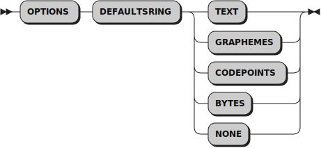
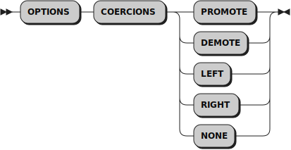

# New values for the OPTIONS instruction

```
┌───────────────────────────────────────────────────────────────────────────────────────────────────────────────┐  
│ This file is part of The Unicode Tools Of Rexx (TUTOR).                                                       │
│ See https://github.com/RexxLA/rexx-repository/tree/master/ARB/standards/work-in-progress/unicode/UnicodeTools │
│ Copyright © 2023, 2024 Josep Maria Blasco <josep.maria.blasco@epbcn.com>.                                     │
│ License: Apache License 2.0 (https://www.apache.org/licenses/LICENSE-2.0).                                    │
└───────────────────────────────────────────────────────────────────────────────────────────────────────────────┘
``` 

## OPTIONS DEFAULTSTRING



``OPTIONS DEFAULTSTRING`` _default_, where _default_ can be one of __BYTES__, __CODEPOINTS__, __GRAPHEMES__, __TEXT__ or __NONE__. 
This affects the semantics of numbers and unsuffixed strings, i.e., ``"string"``, without an explicit B, X, Y, P, T or U suffix. 
If _default_ is NONE, numbers and strings are not converted (i.e., they are handled as default Rexx numbers and strings). 
In the other cases, numbers and strings are transformed to the corresponding type. For example, if OPTIONS DEFAULTSTRING TEXT is in effect, ``"string"`` will automatically be a TEXT string,
as if ``"string"T`` had been specified, i.e., ``"string"`` will be composed of extended grapheme clusters, and will be automatically normalized to the NFC Unicode normalization form if needed; if OPTIONS DEFAULTSTRING GRAPHEMES is in effect, ``"string"`` will automatically be a GRAPHEMES string, as if ``"string"G`` had been specified, i.e., ``"string"`` will be composed of extended grapheme clusters, with no automatical normalization; , and if OPTIONS DEFAULTSTRING CODEPOINTS is in effect, ``12.3`` will automatically
be a CODEPOINTS string, as if ``CODEPOINTS(12.3)`` had been specified.

By default, RXU works as if OPTIONS DEFAULTSTRING TEXT had been specified.

__Note.__ Currently, OPTIONS DEFAULTSTRING does not apply to variable and constant symbols. This will be fixed in a future release.

__Implementation restriction:__ This is currently a global option. You can change it inside a procedure, and it will apply globally, not only to the procedure scope.

__Examples.__

```
Say Stringtype("string")                          -- BYTES (the default)
Options Defaultstring CODEPOINTS
Say Stringtype("string")                          -- CODEPOINTS
Say Stringtype(1024)                              -- CODEPOINTS too
Say Stringtype("12"X)                             -- BYTES: X, B and U strings are always BYTES strings
Say Stringtype("string"T)                         -- TEXT (Explicit suffix)
```

__Implementation notes:__

RXU translates an unsuffixed string ``"string"`` to the following expression:
```
(!DS("string"))
```
!DS is a helper routine defined in ``Unicode.cls``; DS stands for Default String. !DS implements the current OPTIONS DEFAULTSTRING setting.

## OPTIONS COERCIONS



``OPTIONS COERCIONS`` _behaviour_, where _behaviour_ can be one of __PROMOTE__, __DEMOTE__, __LEFT__, __RIGHT__ or __NONE__. This instruction determines
the behaviour of the language processor when a binary operation is attempted in which the operators are of different string types, for example,
when a BYTES string is contatenated to a TEXT string, or when a CODEPOINTS number is added to a BYTES number.

* When _behaviour_ is __NONE__ a Syntax error will be raised.
* When _behaviour_ is __PROMOTE__, the result of the operation will have the type of the highest operand (i.e., TEXT when at least one of the operands is TEXT, or else CODEPOINTS
  when at least one of the operands is CODEPOINTS, or BYTES in all other cases).
* When _behaviour_ is __DEMOTE__, the result of the operation will have the type of the lowest operand (i.e., BYTES when at least one of the operands is BYTES, or else CODEPOINTS
  when at least one of the operands is CODEPOINTS, or TEXT in all other cases).
* When _behaviour_ is __LEFT__, the result of the operation will have the type of the left operand.
* When _behaviour_ is __RIGHT__, the result of the operation will have the type of the right operand.

Currently, OPTIONS COERCIONS is implemented for concatenation, arithmentic and logical operators only. 

By default, RXU works as if OPTIONS COERCIONS PROMOTE had been specified.

__Note.__ This variant of the OPTIONS instruction is _highly experimental_. Its only purpose is to allow experimentation with implicit coercions. Once a decision is taken about
the preferred coercion mechanism, it will be removed.

__Implementation restriction:__ This is a global option. You can change it inside a procedure, and it will apply globally, not only to the current scope.

__Examples.__

```
Options Coercions Promote
Say Stringtype( "Left"B || "Right"P )             -- CODEPOINTS
Say Stringtype( "Left"B || "Right"T )             -- TEXT
Say Stringtype( "Left"P || "Right"T )             -- TEXT
Options Coercions Demote
Say Stringtype( "Left"B || "Right"P )             -- BYTES
Say Stringtype( "Left"B || "Right"T )             -- BYTES
Say Stringtype( "Left"P || "Right"T )             -- CODEPOINTS
Options Coercions Right
Say Stringtype( "Left"B || "Right"P )             -- CODEPOINTS
Say Stringtype( "Left"B || "Right"T )             -- TEXT
Say Stringtype( "Left"P || "Right"T )             -- TEXT
Options Coercions None
Say Stringtype( "Left"B || "Right"B )             -- BYTES
Say Stringtype( "Left"B || "Right"P )             -- Syntax error
```

## Implementation notes

The RXU Rexx Preprocessor for Unicode implements the OPTIONS instruction in the following way: when an OPTIONS instruction is encountered, say
```
OPTIONS optiona optionb
```
the preprocessor transforms it into
```
Do; !Options = optiona optionb; Call !Options !Options; Options !Options; End
```
``!OPTIONS`` is a routine defined in ``Unicode.cls``.
